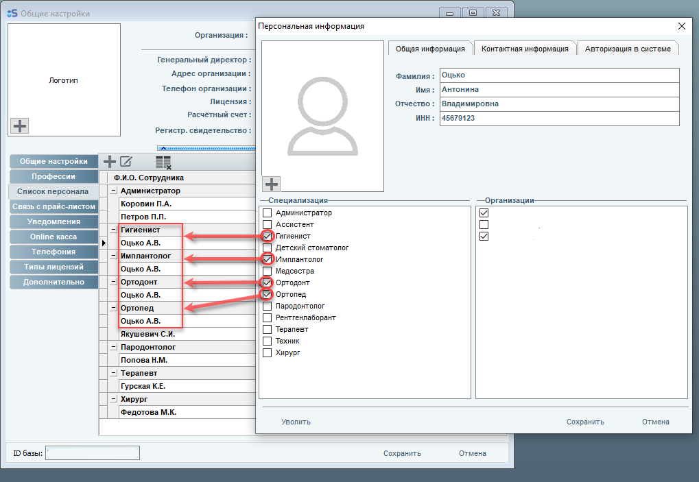
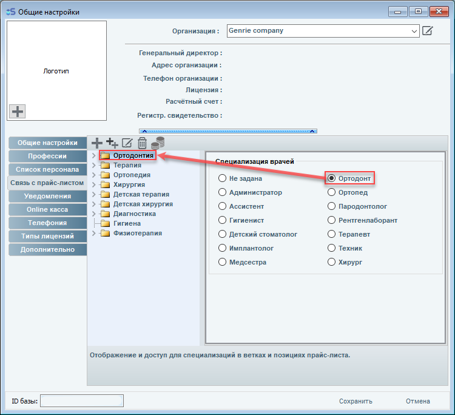
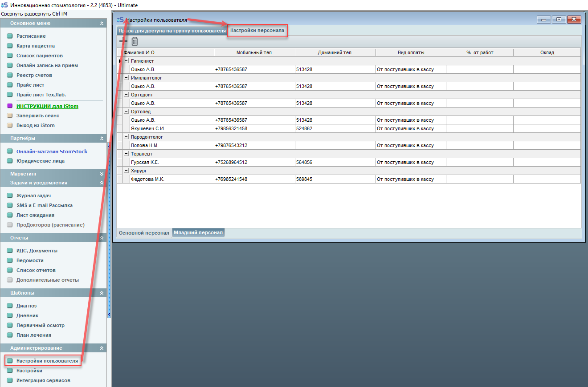
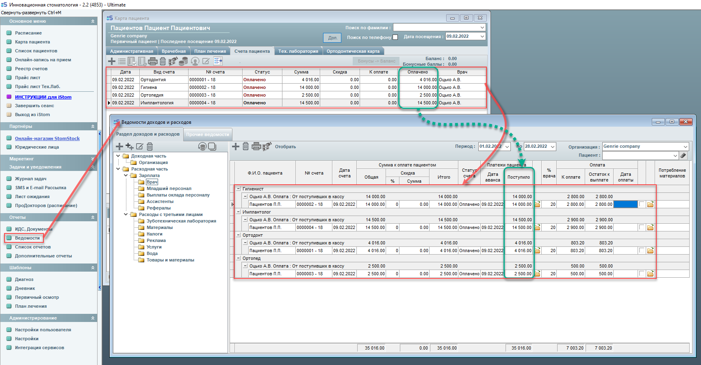
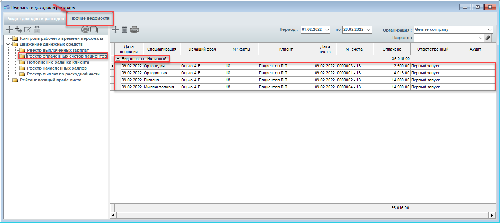

# Профессии врачей

---

## Настройка профессий врачей

Настройки профессий врачей.

Тут мы указываем профессии врачей. Программа уже поставляется с определенным набором предустановленных профессий.

Вы можете добавить нужную профессию по вашему усмотрению.

Так же здесь необходимо присвоить тип персонала вашим профессиям:

Старший персонал - это, как правило, врачи. Они будут отображаться в расписании приема.

Младший персонал - это второстепенные сотрудники вашей клиники. Они не будут отображаться в расписании.

Для этого в нашей программе предусмотрено разделение на старший и младший персонал.

---

## Как настроить врачу несколько профессий

#### Как настроить врачу несколько профессий?

Для того, чтобы добавить или убрать дополнительные профессии - откройте общие настройки, пункт "Список персонала", найдите нужного врача, нажмите два раза на него и в открывшемся окне, в поле "Спецализация" настройте профессии врача как вам нужно, а затем сохраните изменения, нажав "Сохранить".

Иначе, если же врач еще не заведён в программу, тогда настройки начинаем с добавления врача и его специализаций. Откройте раздел "Список персонала" в общих настройках программы, затем нажмите на значок +, далее вводим данные врача, ставим галочку у нужных специализаций, указываем организацию и сохраняем. В примере гигиенист, имплантолог, ортодонт и ортопед - это один человек.

Проверяем настройки прайс-листа во вкладке "Связь с прайс-листом". Должны быть сопоставлены прайс и специальность, по которой будет рассчитываться зарплата врача.

Сохраняем.

Переходим в раздел "Настройки пользователя", переключаем на вкладку "Настройки персонала" и настраиваем зарплаты врачей. Добавляем, если нет нужного в списке, врача нажатием на кнопку "+", выбрав галочками необходимое. Каждой специализации необходимо добавить врача, указать вид оплаты и процент от работ или оклад.

Закрываем. Настройка завершена. Проводим оплату. Для каждой специализации на данного врача выставляется отдельный счет. Счет отобразится в ведомости только после первой оплаты или внесения пациентом аванса или полной оплаты счета.

В ведомости все оплаченные счета отобразятся на одного врача отдельно и по специальностям. Если зайти в меню "Ведомости" во вкладку "Прочие ведомости",открыть "Реестр оплаченных счетов пациентов", то можно посмотреть, какого вида была произведена оплата услуг.

---

## Как сменить врача при формировании счета за услуги

#### Как сменить врача при формировании счета за услуги?

Для смены врача нужно иметь в меню "Карта пациента" во вкладке "Лечащие врачи" врача такой же специальности, так как врачи меняются только в рамках одной специализации (например, терапевт на терапевта).

---

## Что делать после удаления врача

#### Что делать, если после смены профессии врача, в расписании исчезли все записи пациентов, которые были записаны ранее к этому врачу?

Это связано с тем, что смена профессии несёт за собой соответственно пустые записи, ведь, например, на терапевта Иванова не делали запись, а на ортопеда Иванова - делали.

---

## Я один врач как терапевт, хирург и ортопед. Как мне вести программу и создавать счета

#### Я один врач как терапевт, хирург и ортопед. Как мне вести программу и создавать счета?

Выберите одну специальность и ведите по ней. Так же можно создать профессию "универсал" в настройках  или через запятую ввести три специальности. Это можно сделать во вкладке "Профессии врачей", потом в списке персонала указать у себя в карточке ту специальность, которая вам нужна. Далее во вкладке "Вид прайс-листа" нужно поставить галочку в нужных прайсах специализации.

---

