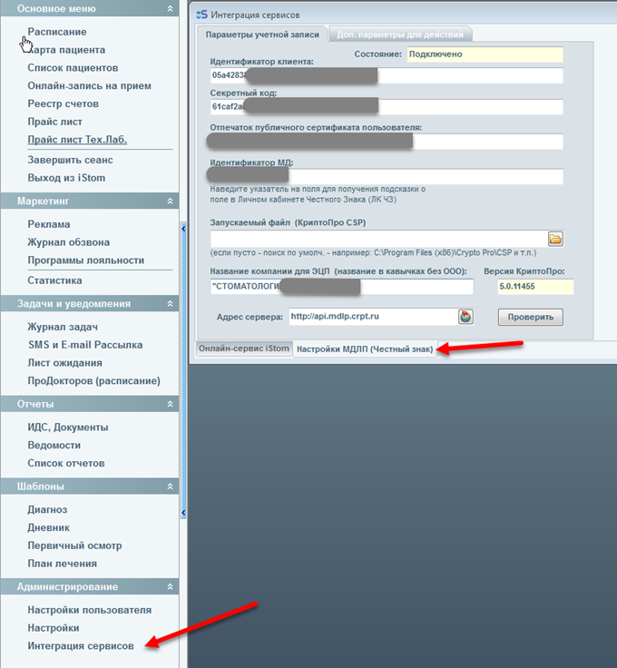
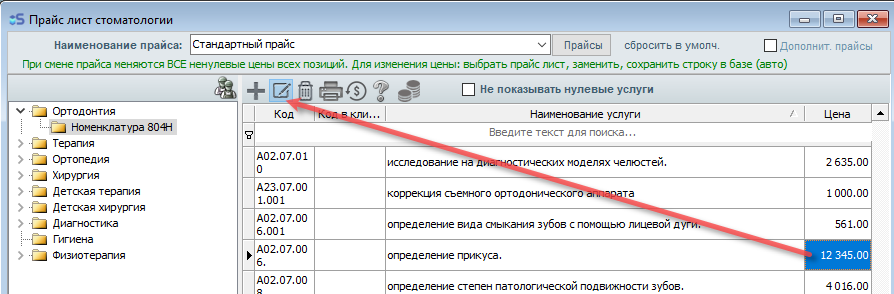
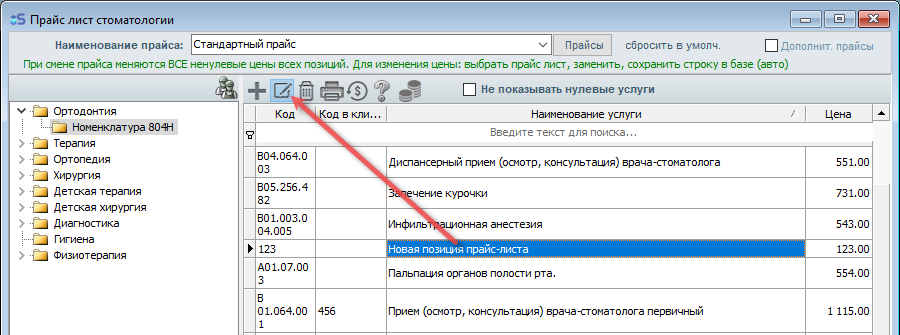
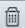
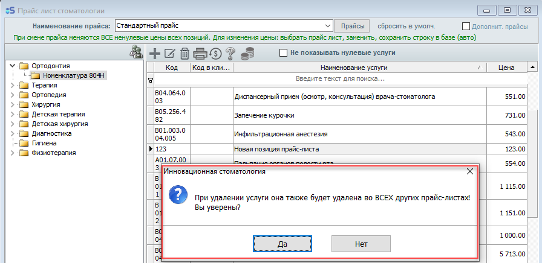

# Index

---

## общие натср.

Общие настройки программы.

Общие настройки

Файловый обмен

Настройка путей для хранения всех документов и снимков.

Если вы работаете по сети, то лучше всего хранить файлы на сетевом диске. Для этого подойдет [[YandexDisk]{.underline}](https://disk.yandex.ru/) или [[Google диск]{.underline}](https://www.google.ru/drive/).

Графические образы находятся в папке C:\\Program Files\\iStom\\upload - это место, где хранятся снимки и фото пациентов.

Отчетность ИДС и прочее находится в папке C:\\Program Files\\iStom\\IDS - это путь к документам.

Нумерация карт.

Маска карты - это вид отображения номера карты.

По умолчанию это номер по порядку. У каждой новой заведенной карты номер будет увеличиваться по возрастанию на 1.

Например вид отображения 2016-125, для этого надо ввести в поле маска карты {YYYY}-{CurNum}.

Помимо того, что сюда можно подставлять шаблоны, которые мы предоставили (справа внизу), можно также добавлять абсолютно любые свои. Например буквы, цифры и любые коды которые вы придумаете.

После ввода данных нажать на текст \"Конвертация всех карт по условиям\".

Критерий уникальности влияет на номер по порядку - {CurNum}, то есть задает счетчик для сброса номера по порядку, согласно определенному правилу. Если там установлен месяц, то каждая следующая созданная карта с началом каждого месяца будет начинаться с единицы.

Пример 1.

Если у вас маска карты

{CurNum}-{DD}-{MM}

и критерий уникальности

{MM}

Тогда номер карты {CurNum} будет начинаться с единицы с началом каждого нового месяца. То есть, если вы 1 января создали первого пациента, а потом второго, то номера карт будут следующими:

1-01-01

2-01-01

Когда закончится месяц, и возможно у вас будут уже пациенты под номерами:

243-31-01

244-31-01

После наступления нового месяца счетчик сбросится и номера будут следующими:

1-01-02

1-02-02

Пример 2.

Если у вас маска карты

{CurNum}{DD}или{Company}-{CurNum}

и критерий уникальности {YYYY}

Тогда номера карты {CurNum} будут начинаться с единицы с началом каждого нового года.

Пример 3.

Если у вас маска карты

ПАЦИЕНТ-{CurNum}{DD}

или

{Company}{CurNum}{DD}и

критерий уникальности {DD}

Тогда номера карты {CurNum} будут начинаться с единицы с началом каждого нового дня.

[Настройки SMS шлюза](https://docs.i-stom.ru/nastrojka_sms.htm)

Это настройки СМС рассылок из программы.

Для получения данных для активации сервиса, ознакомьтесь с соответствующим разделом инструкции.

---

## описание кнопок

Обозначение кнопок

Описание кнопок программы

{width="0.2708333333333333in" height="0.25in"} - Создание документа, карты, счета и прочего или добавления данных фото, основного уровня в ведомостях, настройках и шаблонах, и прочих данных.

{width="0.2708333333333333in" height="0.25in"} - Добавление подуровня в ведомостях, настройках и шаблонах.

{width="0.2708333333333333in" height="0.2708333333333333in"} - Удаление. В некоторых разделах программы iStom, удаление доступно по нажатию правой кнопки мыши.

{width="0.3020833333333333in" height="0.2916666666666667in"} - Вывод на печать документов и экспорт в 1С и другие форматы. Во многих разделах программы iStom, имеется выбор что нужно вывести на печать.

{width="0.25in" height="0.2604166666666667in"} - Экспорт печатных форм в 1С и другие форматы. Кнопка доступна после нажатия кнопки принтера (печати).

{width="1.25in" height="0.28125in"} - Увеличение/уменьшение печатных форм для удобства их просмотра.

{width="1.7291666666666667in" height="0.3020833333333333in"} - Переключение между страницами в печатных формах, а также кнопки перехода в начало и конец документа.

{width="0.23958333333333334in" height="0.23958333333333334in"} - Редактирование данных.

{width="0.2604166666666667in" height="0.2708333333333333in"} - Шаблоны, прайс-листы и прочие списки с данными для заполнения разделов программы.

{width="0.2708333333333333in" height="0.28125in"} - Формирование счетов из плана лечения.

{width="0.2708333333333333in" height="0.23958333333333334in"} - Подписанные пациентом документы (кнопка добавляется автоматом после вывода на печать первого подписанного документа).

{width="0.3229166666666667in" height="0.3125in"} - Пополнение баланса пациента.

{width="0.3125in" height="0.2916666666666667in"} - Проведение оплаты в текущем счете и ведомостях.

{width="0.3125in" height="0.28125in"} - Кнопка показа списка событий для выбранного пациента в расписании. (кнопка доступна в административной вкладке карты пациента).

{width="0.3125in" height="0.3020833333333333in"} - кнопка звонка.

---

## ЧЗ_настройки

#### Инструкция по настройке МДЛП (Честный Знак)

Для начала запускаем iStom, в разделе «Администрирование» нажимаем на

«Интеграция сервисов», далее открываем внизу открывшегося окна вкладку

«Настройки МДЛП (Честный знак)» как показано на изображении ниже.

{width="6.496527777777778in" height="7.03125in"}

\... полный текст инструкции доступен в вашем личном кабинете по адресу <https://cloud.i-stom.ru/login>

Уважаемые пользователи, инструкция по настройке МДЛП ЧЗ была написана очень подробно специально для того, чтобы каждый мог разобраться, что, где, когда и как нажимать, отнеситесь, пожалуйста, с пониманием, если вам необходимо найти что-то - в инструкции присутствует оглавление!!!

на панели навигации находим раздел \"Скачать\", выбираем его и скачиваем полную инструкцию по настройке МДЛП ЧЗ

{width="5.895833333333333in" height="7.427083333333333in"}

---

## ЧЗ_работа

#### Инструкция по работе с МДЛП (Честный знак)

*На данный момент в нашей программе отсутствует возможность оприходования товаров с подключением к системе маркировки и в виду недавних изменений в процедуре маркировки, данная функция стала необходима, и мы уже занимаемся её внедрением в программу iStom.*

Сейчас мы можем предоставить возможность списания товаров по МДЛП.

------------------------------------------------------------------------

Уважаемые пользователи, инструкция по настройке МДЛП ЧЗ была написана очень подробно специально для того, чтобы каждый мог разобраться, что, где, когда и как нажимать, отнеситесь, пожалуйста, с пониманием, если вам необходимо найти что-то - в инструкции присутствует оглавление!!!

------------------------------------------------------------------------

После прочтения инструкции по интеграции МДЛП ЧЗ и выполнения всех шагов по настройке, в программе iStom на вкладке Склад основного меню появится дополнительный раздел «МДЛП (Честный знак)» и пункты меню для соответствующих окон.

Проверить статус соединения с ЧЗ можно по нажатию на флажок в правом нижнем углу программы iStom:

1\. Если все настройки проведены правильно, тогда иконка должна быть вот такая (Карточка и буквы ЧЗ):

{width="4.489583333333333in" height="1.4375in"}

2\. Если при настройке были допущены ошибки либо потеря соединения с интернетом и соединение с честным знаком не установлено, тогда иконка будет вот такая (Минус и буквы ЧЗ):

{width="4.583333333333333in" height="1.5833333333333333in"}

Порядок работы показан на рисунках ниже с указанием порядка выбора.

{width="2.1354166666666665in" height="7.375in"}

1 Регистрация выдачи лекарственных препаратов для лечения

1.1 Выбрать в окне склада позиции номенклатуры, которые требуется провести расходование препаратов, выбрать пункт меню по МДЛП, перейти в окно «Список товаров для списания»,

{width="6.496527777777778in" height="2.9131944444444446in"}

1.2 В окне «Список товаров» изменить (если необходимо доли расходования упаковок, если расходуется полностью --- оставить числитель 1, знаменатель 1, считать/ввести SGTIN -- с упаковки, которая расходуется, нажать Enter, либо вне поля ввода SGTIN, чтобы значение записалось в поле. В документ добавляются только позиции с непустым значением SGTIN.

1.3 «Создать документ», - добавить новый учетный документ, подготовленный для системы МДЛП, перейти в окно «Список Документов по МДЛП», нажать для выбранного документа «Регистрация Выдачи» - в случае успешной регистрации в системе МДЛП пользователю будет выдано соответствующее сообщение с указанием кода документа в системе, иначе будет сообщено об ошибке. Для зарегистрированных документов изменится статус записи.

{width="6.496527777777778in" height="5.6402777777777775in"}

Примечание:

В данной версии программы допускается повторная регистрация лекарственных препаратов и создание дублирующих документов с последовательными номерами для них. Контролировать корректность и состав для зарегистрированных документов по расходованию пользователь должен самостоятельно.

Списанные по МДЛП товары можно также посмотреть в ЛК ЧЗ в разделе Реестр документов \--\> Отправленные.

{width="6.496527777777778in" height="3.267361111111111in"}

---

