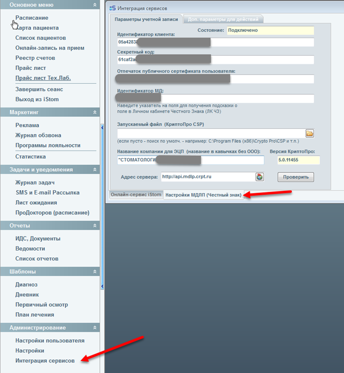
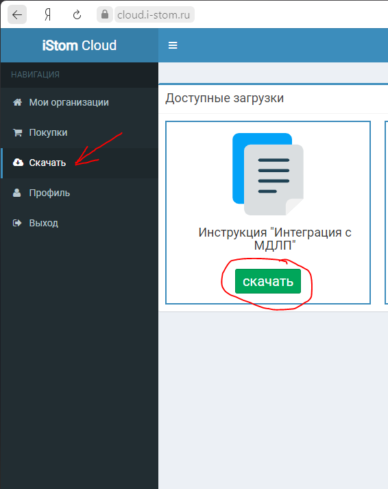
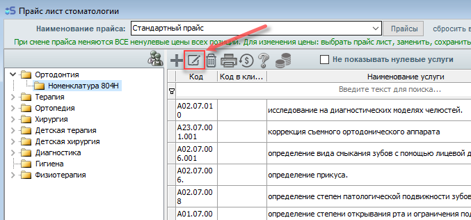
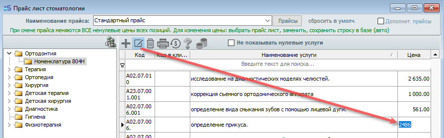
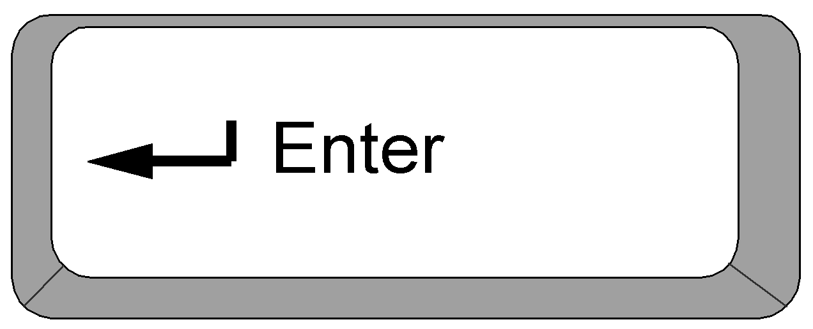
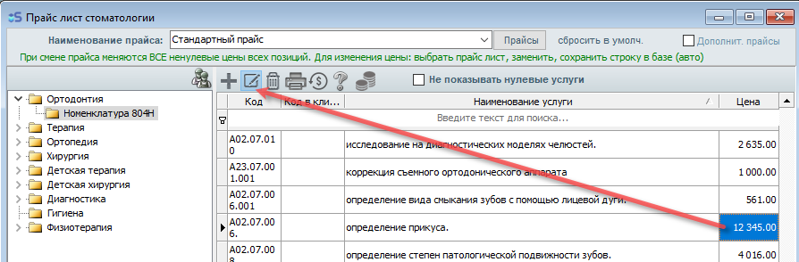
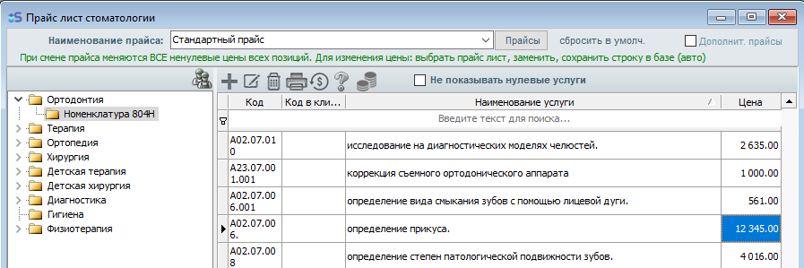

# Salary

---

## настр.зп

#### Настройка зарплат персонала.

Пункт меню \"Настройки персонала\" содержит в нижней части окна две вкладки:

Основной персонал и младший персонал. В разделе основной персонал мы настраиваем вид зарплаты, процентную ставку и оелпд, если он есть. В разделе \"Младший персонал\" выбираем вид оплаты, ставим оклад и стоимость зарплаты за один снимок.

---

## Зарплата врачей и младшего персонала

Зарплата врачей и младшего персонала.

Для настройки зарплат сотрудников откройте \"Настройки пользователя\" - вкладка вверху \"Настройки персонала\".\
После проделанных действий у вас открыто окно настройки основного персонала:

Выберите вид оплаты, с которого сотрудник будет получать процент.

Укажите процент, либо оклад. В случае, если вид оплаты выбран \"От суммы без скидки + оклад\" - укажите и оклад, и процент.

Для настройки зарплат для младшего персонала откройте вкладку \"Младший персонал\", которая находится в левом нижнем углу.

Также по своему усмотрению заполните поля для персонала. (Для младшего персонала, работающего по часовой оплате или по суточной и делающего снимки указываются суммы в соответствующих полях)

Готово, зарплаты настроены.

Для просмотра зарплат сотрудникам откройте окно \"Ведомости\" из главного меню, раздел \"Расходная часть\", подраздел \"Зарплата\".

В пункте \"Врач\" счета отображаются только после первой оплаты или внесения пациентом аванса или полной оплаты счета.

Для просмотра зарплат младшего персонала - откройте соответствующий пункт \"Младший персонал\".

Для добавления записи о выплате оклада младшему сотруднику - нажмите +, выберите сотрудника, а затем заполните недостающие поля. (В случае Ассистента и медсестры, если вы ведёте график работы данных сотрудников через распиание - тогда начисления по их зарплате будут отображаться в данном разделе автоматически)

После заполнения необходимых полей, чтобы зафиксировать дату выплаты зарплаты сотруднику, вы можете выбрать галочкой в конце строки сотрудника, нажать \"Внесение оплаты\" на панели вверху и затем нажать \"Оплатить\":

После этого, строка сотрудника будет подсвечена зелёным цветом, теперь в ведомости будет стоять дата выплаты зарплаты сотруднику:

-

---

