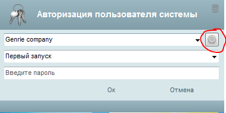
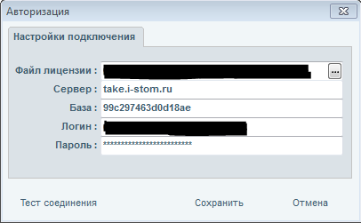

# База данных

#### Как узнать номер базы?

1. Для того, чтобы узнать номер базы в программе iStom, вам необходимо открыть окно авторизации программы iStom и нажать на кнопку с шестеренкой.

2. После нажатия появится окно информации о программе iStom, из которого вы можете скопировать данные, то есть номер базы.

