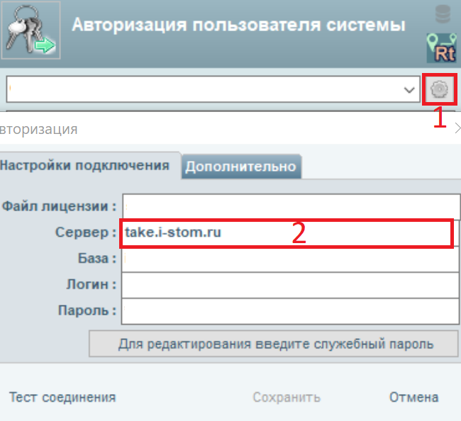

# Облако или Локальная база

---

## Как узнать, облачное или локальное хранение в нашей клинике?

При авторизации в программу справа от наименования клиники кнопка в виде "Шестерёнка". Нажимаем.
Если там написано: "take.i-stom.ru" - то это значит, что у вас облачное хранение, а  если написан другой сервер - то это значит, что локальное хранение и программа работает без интернета и мобильных приложений.

---

## Где находятся ваши сервера и где хранится база данных?

Все сервера и базы данных находятся в России (Москва).

---

