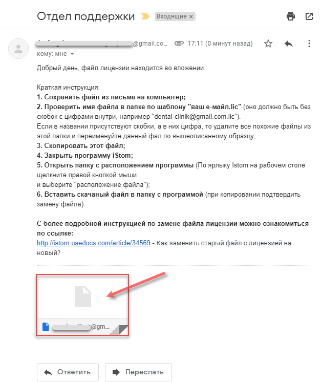
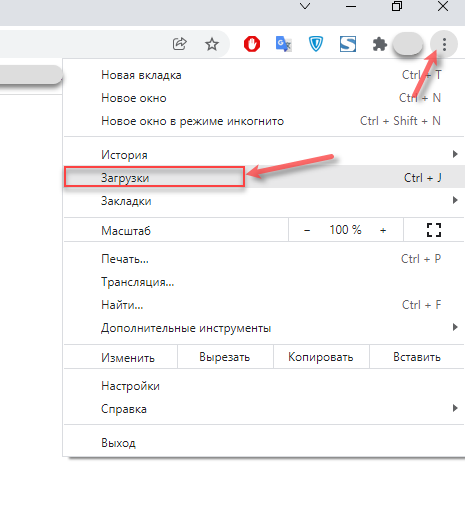

# Лицензии

---

## Как заменить старый файл с лицензией на новый?

При возникновении ситуации, когда вам необходимо заменить ключ лицензии на другой - отдел технической поддержки, с которым вы связываетесь, отправляет вам на электронную почту файл лицензии.

Данный файл имеет расширение "ваш е-майл.lic".

- Например "dent-cliniс@gmail.com.lic" -

1. Данный файл вам необходимо скачать на свой компьютер. (По умолчанию файл будет скачан в папку "Загрузки")

2. Закройте программу iStom на компьютере, если она у Вас открыта в данный момент.

3. Откройте программу вновь и нажмите в окне авторизации в верхнем левом углу иконку в виде Ключей.

4. У Вас откроется окно выбора лицензии, которую только что скачали. По умолчанию файл лицензии Вы найдёте в папке "Загрузки". Дважды нажмите на лицензию. 

Всё, файл лицензии заменён. 

---

## Распределение лицензий для сотрудников

В системе управления клиникой iStom присутствует возможность определения типа лицензии в программе для каждого пользователя.

Чтобы провести распределение лицензий между сотрудниками — перейдите в настройки как показано на рисунке ниже.

Для каждого сотрудника укажите тип лицензии, которая будет за ним закреплена.

Для того, чтобы исключить сбои в работе используется алгоритм «понижения» уровня лицензии.

*Пример*

*Вы имеете лицензии:*

*Ultimate (1 шт),*

*Professional (1 шт),*

*Standart (2 шт),*

*следовательно, вы не сможете запустить более 4 активных сессий, так как работает ограничение по общему количеству активных сессий.*

*Также, в программе работает ограничение по каждому типу лицензий, а именно, если вам присвоен тип лицензии Ultimate, а в ключе количество купленных лицензий Ultimate всего одна, то следующий, кто попытается зайти с таким же типом лицензии — будет авторизирован в программе с лицензией по входу Professional, т.е. сработает механизм понижения уровня лицензии, НО! Если вдруг и количество активных сессий по лицензии Professional будет превышать лимит — то тип лицензии по входу определится как Standart, а если и все лицензии Standart будут «заняты» - тогда в программу вы не сможете войти. То есть: если у вас куплено 4 пакета, то одновременно в программе могут работать только 4 пользователя.*

Пользователь «Первый запуск» - также учитывается при подсчёте количества активных сессий, поэтому сверх общего ограничения запустить программу под этим пользователем не получится.

Для удобства при запросе данных для входа есть возможность посмотреть

список активных сессий, как показано на рисунке.

---

## Хочу купить программу, но не готов давать свои данные.

Предоставление данных об организации необходимо для:
1.  Регистрации клиента iStom и дальнейшей регистрации личного кабинета
2.  Формирования лицензионного ключа для вашей организации

---

