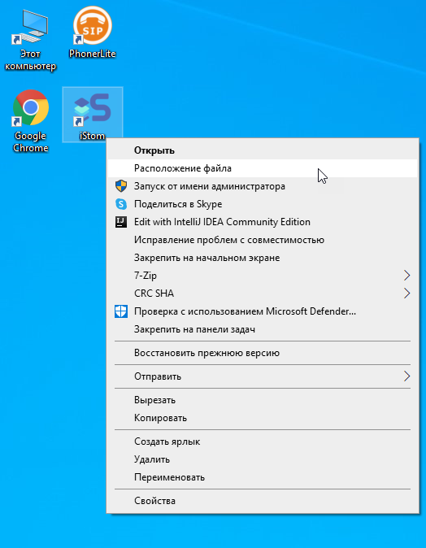
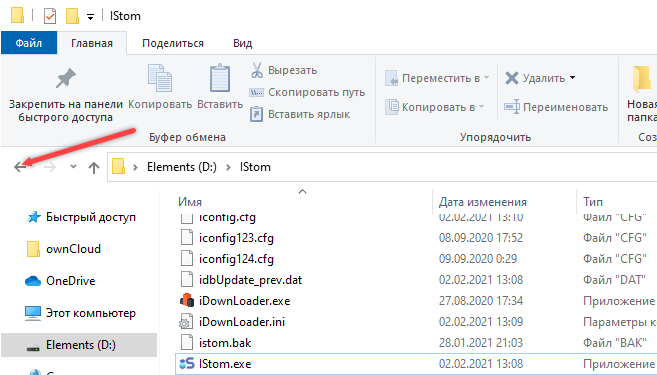
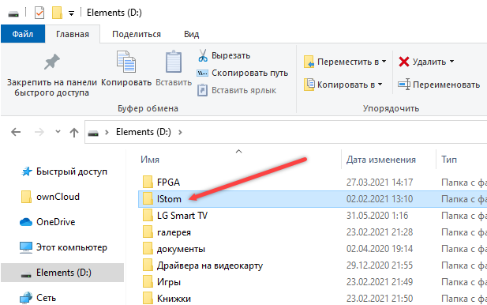
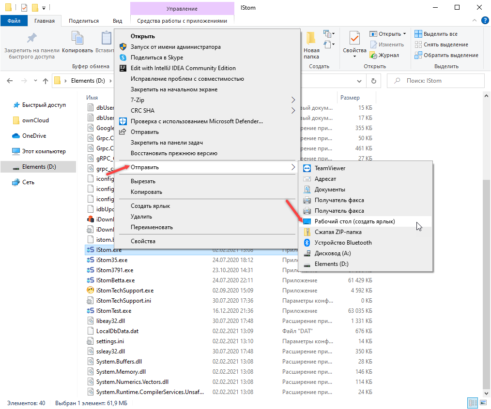

#### Как переместить программу iStom на другой компьютер?

Чтобы скопировать программу iStom на другой компьютер вам необходимо скопировать папку с программой и файлами настроек.

Порядок действий:

1\. Правой кнопкой мыши нажать на ярлык программы iStom, а затем \"Расположение файла\":

2\. В открытом окне располагаются все данные, которые необходимо скопировать, поэтому мы копируем её полностью (выходим из папки назад и копируем всю папку iStom):

3\. Копируем папку с программой на носитель, а с него затем на другой компьютер в удобную для вас папку.

4\. На другом компьютере после копирования папки с программой - открываем её и правой кнопкой нажимаем на файл iStom.exe, затем нажимаем \"Отправить\" и \"Рабочий стол (создать ярлык)\":

5\. Теперь можно пользоваться программой, ярлык для запуска на рабочем столе.
