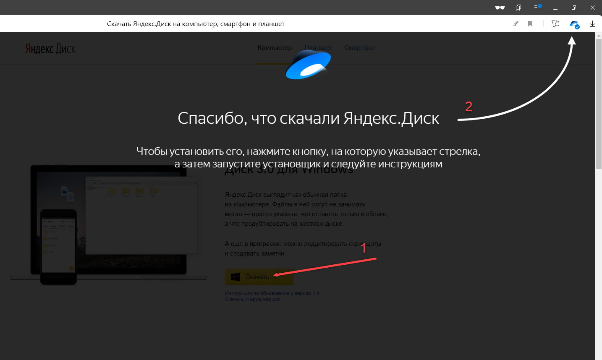
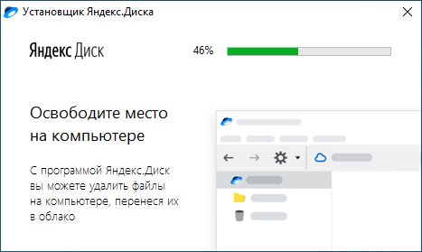
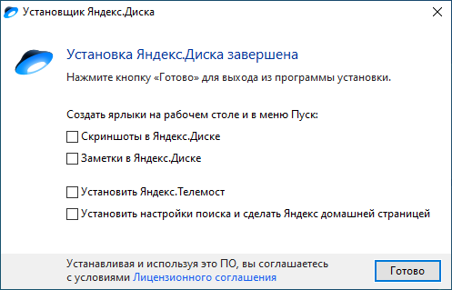
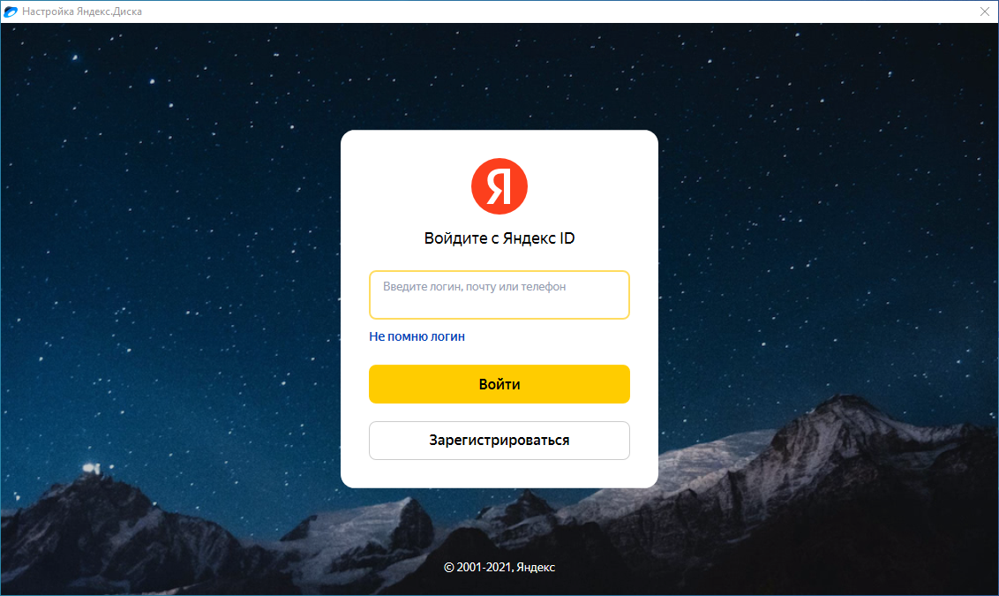
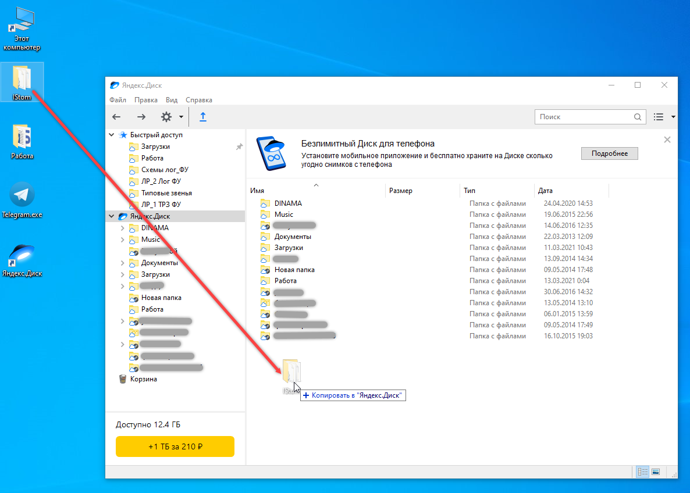
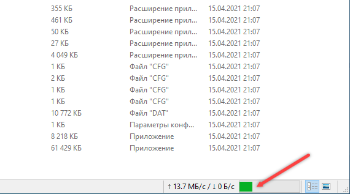
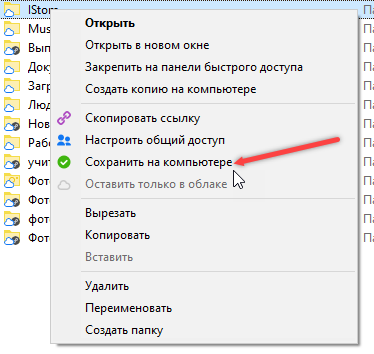
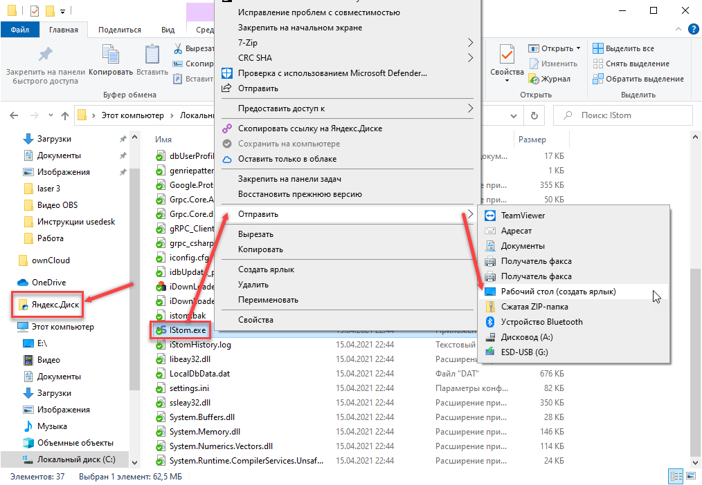

# Работа с Яндекс.Диском

#### Как работать в iStom на нескольких компьютерах используя Yandex Disk

Сперва необходимо установить программу iStom на компьютер, не важно на какой, главное, чтобы за ним потом работали.

После установки нашей программы - необходимо поставить сам Yandex Disk на ВСЕ компьютеры, за которыми будут работать.

!!!ВАЖНО!!!

Все действия, которые вы будете совершать с программой на своём компьютере будут синхронизироваться с яндекс диском и следовательно на остальных компьютерах также будут происходить такие же изменения.

После прохождения всех шагов данной инструкции программу iStom не нужно будет искать где-то в папках компьютера, у вас будет ярлык на рабочем столе.

В программе Яндекс.Диск по умолчанию стоит автозапуск при входе в систему, поэтому она всегда будет запускаться при старте вашей системы и данные будут синхронизироваться с диском, если не будет интернета, то ваши данные не смогут синхронизироваться с диском.

!!!ВАЖНО!!!

Шаги для наглядности представлены со скриншотами:

1. Чтобы скачать установочный файл яндекс диска - переходим по ссылке: " <https://disk.yandex.ru/download#pc> ".

2. Нажимаем на скачанный файл (открывается установка программы)

3. После установки снимаем все галочки и нажимаем "Готово"

4. На рабочем столе появился значок Яндекс.Диск - находим его и нажимаем.

НА ВСЕХ КОМПЬЮТЕРАХ ВХОДИМ ПОД ОДНИМ АККАУНТОМ ЯНДЕКС (это важно!!!)

5. Затем на том компьютере, на который ставили программу iStom, на рабочем столе находим ярлык программы, нажимаем правой кнопкой мыши на нём, затем "Расположение файла", открывается папка с программой, необходимо в проводнике нажать стрелочку назад \<\--  на панели сверху, выйти из этой папки. Открыть окно Яндекс диска и проводник с папкой iStom и левой кнопкой мыши перетащить папку iStom в окно Яндекс диска, как показано на скриншоте (*в моём случае папка находится на рабочем столе, у вас же она просто в другом месте - это не играет роли*).

6. Ждём пока папка загрузится на диск\...

------------------------------------------------------------------------

7. На ВСЕХ компьютерах правой кнопкой мыши выбираем нашу папку iStom и жмём "Сохранить на компьютере".

8. (НА ВСЕХ КОМПЬЮТЕРАХ) Ждём пока загрузится папка на компьютер и после того открываем проводник, слева  в проводнике жмём на папку Яндекс.Диск, заходим в папку IStom, находим файл iStom.exe, жмём на него правой кнопкой, "Отправить", "Рабочий стол (Создать ярлык)".

Всё! Можно работать в программе iStom на нескольких компьютерах с помощью Яндекс.Диск. ЯРЛЫК НА РАБОЧЕМ СТОЛЕ.
