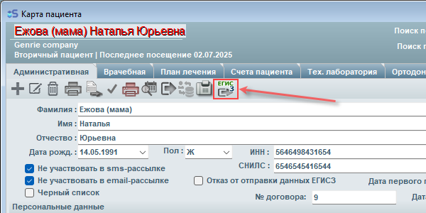

# ЕГИСЗ — Единая государственная информационная система здравоохранения

Модуль ЕГИСЗ позволяет передавать данные о приёмах пациентов в Единую государственную информационную систему здравоохранения (ЕГИСЗ) с использованием электронных цифровых подписей (ЭЦП).

## Общая информация

-	Обмен данными с ЕГИСЗ в программе возможен только для случая, когда есть запись в личном кабинете iStom и клинике присвоен уникальный идентификатор. 
-	Для работы необходимо подключение модуля ЕГИСЗ, что выполняется сотрудниками службы технической поддержки iStom. Модуль ЕГИСЗ функционирует, как опция (режим работы) программы, поэтому изменения состава файлов программы iStom или добавления каких-либо файлов не требуется. 
-	Для работы с электронными цифровыми подписями (ЭЦП) требуется установка на персональный компьютер (ПК) системы КриптоПро версии не ниже 5. 
-	Для настройки проверки медицинских документов пользователь должен иметь доступ к личному кабинету на [портале РосМинЗдрава](https://portal.egisz.rosminzdrav.ru "Портал оперативного взаимодействия участников ЕГИСЗ") - где должны быть, согласованно с сертификатами, заданы записи организации (клиники) и врачей в качестве персонала. 
-	Работа с модулем ЕГИСЗ требует персональной настройки для каждого пользователя отдельно. Данный момент позволяет пользоваться экспортом в ЕГИСЗ на разных ПК клиента iStom с разными сертификатами врачей и электронными ключами ЭЦП. 
-	Для выбора нужной ЭЦП необходимо ввести серийные номера, указанные в программе КриптоПро в свойствах сертификатов. ВАЖНО: Носитель с ключами для КриптоПРО должен быть подключен к ПК! 
-	При активации режима работы с модулем ЕГИСЗ в карточке пациента в списках действий должна появиться соответствующая кнопка. Внешний вид кнопки показан на скриншоте ниже:

-	При посещении у пациента следует уточнить желает ли он, чтобы данные в дальнейшем отправлялись в ЕГИСЗ. Если пациент НЕ согласен, то следует распечатать «Отказ о предоставлении персональных данных». Этот документ находится в разделе «Административная». Нажмите на иконку КРАСНОГО принтера и выберите соответствующий пункт меню.
-	Если пациент согласен на отправку данных, то от пациента обязательно нужно потребовать следующие документы:
-  СНИЛС
-  Паспортные данные
-  Номер телефона
-  Адрес проживания
-	Данные о посещении клиники пациентами следует передавать в течении рабочего дня. Теоретически можно на следующий день в порядке исключения. Про остальное читайте в интернете – Ответственность МО и врача за своевременную отправку документов в РЭМД (реестр электронных медицинских документов). Также будет полезным узнать о юридических последствиях использования электронной цифровой подписи (ЭЦП).
-	Документы, направляемые в РЭМД, должны быть подписаны тем же врачом что проводил приём пациента, также в поле «Должность» должна быть указана корректная специализация врача- такая же как указана в ФРМР у этого сотрудника

!!! info "Обратите внимание"
    Информация на скриншотах является ознакомительной и предназначена для визуального представления о том, как выглядит интерфейс программы. Для корректной настройки и использования функционала читайте описание.

## Разделы документации

- [Настройка ЕГИСЗ](setup.md) — параметры подключения, сертификаты КриптоПро.
- [Отправка данных о приёме пациента](workflow-adult.md) — пошаговая инструкция для врача.
- [Отправка данных о приеме несовершеннолетнего пациента](workflow-child.md) - краткая инструкция по отправке данных о приеме несовершеннолетнего пациента, имеющего поручителя.
