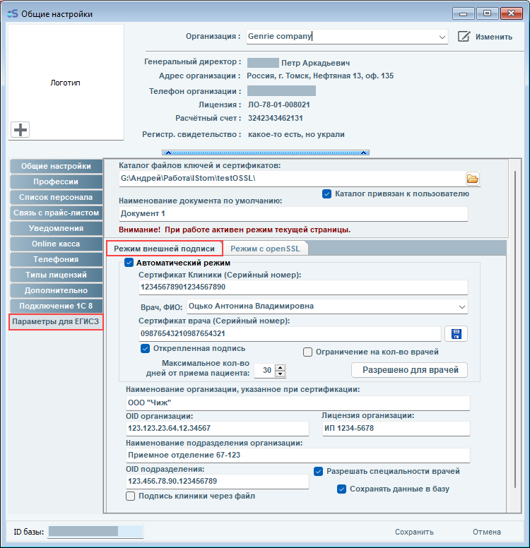
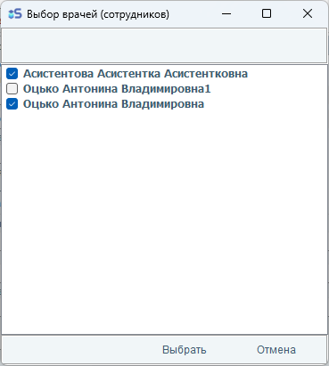
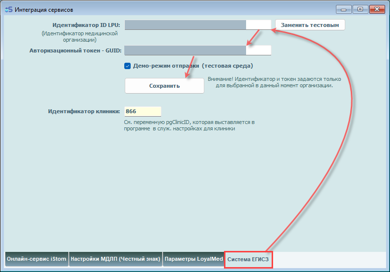

# Настройка параметров для работы с ЕГИСЗ

<!-- Общие настройки, вкладка "Параметры для ЕГИСЗ" -->

## 1. **Настройка подписей и сертификатов.**
Для настройки работы с КриптоПро в данном окне требуется: 
- Выбрать/создать по кнопке открытия служебный каталог, в который будут записываться (перед отправкой) файлы подписей и xml-файл документа. (Данный каталог можно настроить для каждого пользователя отдельно, если выставить галочку «Каталог привязан к пользователю»)
- Ввести текст, с которого будет начинаться наименование документа по умолчанию.  
- Выбрать вкладку «Режим внешней подписи», выставить галочку Автоматический режим, ввести Серийные номера сертификатов из списка в окне КриптоПро (Сертификаты должны быть добавлены в систему КриптоПро). 
- Ввести серийный номер сертификатов клиники и выбранного врача (значение взять из свойств сертификата КриптоПро).
- Выбрать ФИО врача (из списка врачей системы) для данного ПК, подпись которого (серийный номер) будет использоваться в электронных документах. 
- Выставить галочку «Открепленная подпись» (обязательно).
- При необходимости, можно указать несколько врачей (сотрудников), кто может использовать сертификаты для подписи. (Пример окна выбора ниже):

<!-- Выбор врачей (сотрудников) -->

- Указать наименование организации – оно должно совпадать с наименованием в личном кабинете на [портале РосМинЗдрава](https://portal.egisz.rosminzdrav.ru "Портал оперативного взаимодействия участников ЕГИСЗ")
- Указать OID – код организации в системе РосМинЗдрава.
- Указать номер лицензии организации.
- При наличии записи подразделения в личном кабинете на [портале РоМинЗдрава](https://portal.egisz.rosminzdrav.ru "Портал оперативного взаимодействия участников ЕГИСЗ") указать также OID (код) и наименование подразделения. Рекомендуется скопировать названия в поля настроек из ЛК. 
- При необходимости в дальнейшем вручную указывать специальность врача при отправке данных в ЕГИСЗ – необходимо выставить галочку «Разрешить специальности врачей».

!!! note "Персональная настройка"
  Указанные настройки вводятся 1 раз для одного ПК. Для другого пользователя на данном ПК также должны быть введены серийные номера, при этом его сертификат должен быть добавлен в КриптоПро, а ключ подключен к ПК.

## 2. **Общая настройка ЕГИСЗ.**
Для подключения клиники к сервису ЕГИСЗ необходимо заполнить (1 раз для клиники) идентификатор ID LPU и авторизационный токен GUID, выданные данной клинике ЕГИСЗ. Раздел настройки находится в основном меню - Интеграция сервисов – вкладка ЕГИСЗ. Вкладка ЕГИСЗ доступна для пользователя-администратора программы. Настройка записывается в базу данных клиента iStom

<!-- Интеграция сервисов, вкладка "Система ЕГИСЗ" -->
