# Отправка данных о приеме пациента

1. При первом запуске (за активную сессию) окна отправки данных в ЕГИСЗ появляется окно авторизации в лк iStom, где автоматически уже заполнены поля логина и пароля:

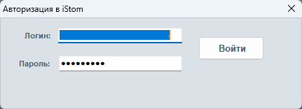

2. Подтверждаем авторизацию и если авторизация прошла успешно, то окно будет выглядеть следующим образом (во второй вкладке получен и отображается токен клиента):

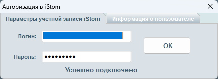

3. После завершения авторизации открывается окно параметров отправки данных в ЕГИСЗ:

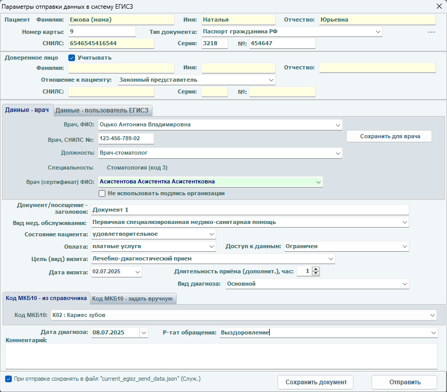

  

## ***В данном окне автоматически заполняются следующие поля:***
### **Для пациента:**

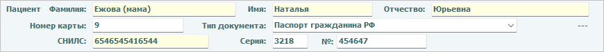
 
- **ФИО**;
- **Номер карты**;
- **Тип документа**  
   – изменяется в выпадающем меню. (по умолчанию "Паспорт гражданина РФ");  
  Полный список, доступных к выбору типов документа, показан на скриншоте ниже:

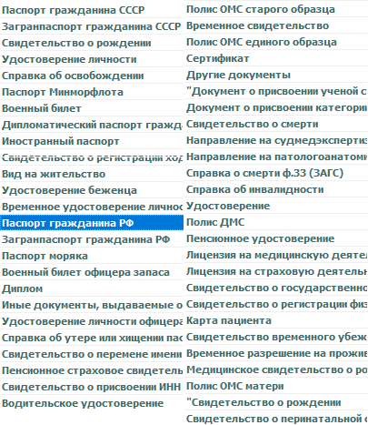
 
### **Доверенное лицо:**
*(если окно открыто из карты пациента, имеющего представителя (раздел поручительство))*

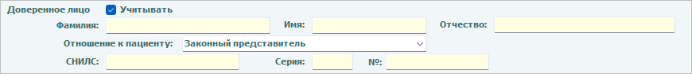

- **ФИО**;
- **Отношение к пациенту**  
  – изменяется в выпадающем меню (по умолчанию "Законный представитель");  
  Полный список, доступных к выбору отношений к пациенту, показан на скриншоте ниже:

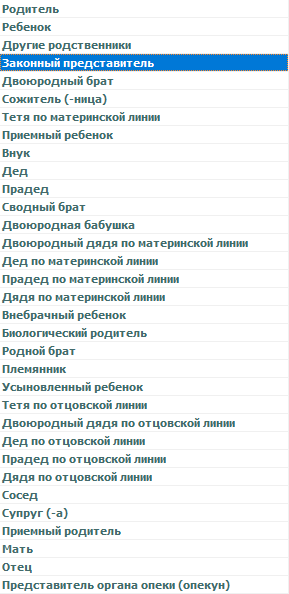

  

## **Врачебный блок (состоит из двух вкладок):**

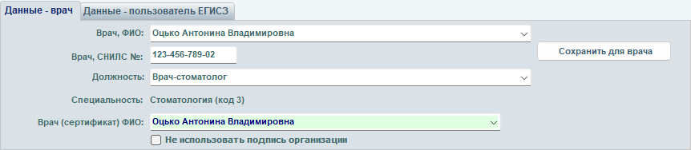

!!! info "Изменены правила отправки данных в РЭМД"
    Теперь документы не обязательно подписывать ЭЦП клиники. Достаточно подписать документы ЭЦП врача и их можно тут же отправлять. Для этого необходимо поставить галочку напротив «Не использовать подпись организации»

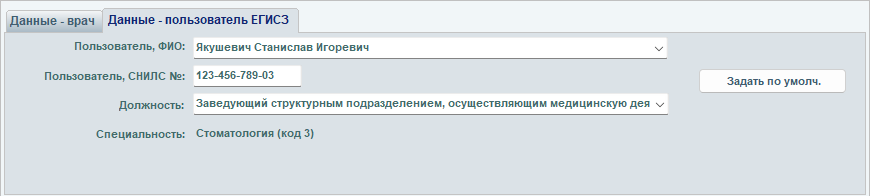

| ***Вкладка «Данные - врач»*** – заполняется данными врача, осуществляющего прием: | ***Вкладка «Данные – пользователь ЕГИСЗ»*** – заполняется личными данными сотрудника, осуществляющего отправку данных о приёме: |
|:------|:-------|
| **Врач, ФИО** – изменяется в выпадающем меню (если активный пользователь авторизован под у/з администратора); | **Пользователь, ФИО** – изменяется в выпадающем меню (если активный пользователь авторизован под у/з администратора); |
| **Врач, СНИЛС №** – значение в поле изменяется и сохраняется в личную информацию врача (при отсутствии значения – оно заполняется вручную и, по кнопке «Сохранить для врача», сохраняется в личную информацию врача); | **Пользователь, СНИЛС №** – значение в поле изменяется и сохраняется в личную информацию врача/сотрудника, осуществляющего отправку данных. |
| **Кнопка «Сохранить для врача»** – для сохранения/изменения номера СНИЛС врача из данной формы в базе. | **Должность** – изменяется в выпадающем меню (по умолчанию "Врач-стоматолог");     !!! note ""    Список должностей аналогичен списку должностей во вкладке «Данные - врач». |
| **Должность** – изменяется в выпадающем меню (по умолчанию "Врач-стоматолог");   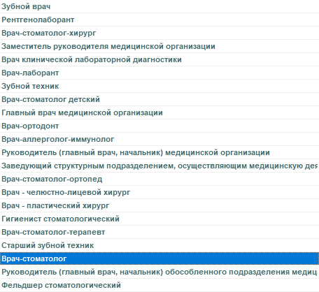 !!! warning "ВАЖНО"    В поле «Должность» должна быть указана корректная специализация врача - такая же как указана в Федеральном Регистре Медицинских Работников (ФРМР) у этого сотрудника. | **Специальность** – заполняется автоматически, если в настройках ЕГИСЗ вы не выставили галочку «Разрешить специальности врачей» (по умолчанию «Стоматология (код 3)»).     Список специальностей ниже:   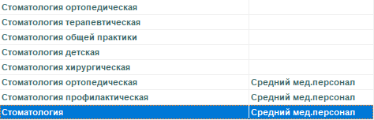 |
| **Специальность** – заполняется автоматически, если в настройках ЕГИСЗ вы не выставили галочку «Разрешить специальности врачей» (по умолчанию «Стоматология (код 3)»).     !!! note ""    Список специальностей аналогичен списку специальностей во вкладке «Данные – пользователь ЕГИСЗ». | **Кнопка «Задать по умолч.»** – позволяет сохранить указанного врача/сотрудника, как осуществляющего отправку данных, по умолчанию.   Заданный врач/сотрудник будет отображаться осуществляющим отправку и для остальных пациентов.   !!! note ""    Выбор можно изменить: выбрать другого врача/сотрудника, затем нажать кнопку «Задать по умолч.» |
| **Врач (сертификат) ФИО** – ФИО врача, указанного в сертификате |  |
| **Чек-бокс «Не использовать подпись организации»** - использовать в случае, если вы не хотите подписывать документ от имени организации. |  |

  

<table style="width: 100%; border-collapse: collapse; table-layout: fixed;">
  <thead>
    <tr>
      <th style="background-color: #FFF3CD; padding: 12px; text-align: left; width: 50%;">
        <strong>Вкладка «Данные — врач»</strong> – заполняется данными врача, осуществляющего приём:
      </th>
      <th style="background-color: #E6F7FF; padding: 12px; text-align: left; width: 50%;">
        <strong>Вкладка «Данные – пользователь ЕГИСЗ»</strong> – заполняется личными данными сотрудника, осуществляющего отправку данных о приёме:
      </th>
    </tr>
  </thead>
  <tbody>
    <tr>
      <td style="padding: 12px; vertical-align: top; word-wrap: break-word;">
        <strong>Врач, ФИО</strong> – изменяется в выпадающем меню (если активный пользователь авторизован под у/з администратора);
      </td>
      <td style="padding: 12px; vertical-align: top; word-wrap: break-word;">
        <strong>Пользователь, ФИО</strong> – изменяется в выпадающем меню (если активный пользователь авторизован под у/з администратора);
      </td>
    </tr>
    <tr>
      <td style="padding: 12px; vertical-align: top; word-wrap: break-word;">
        <strong>Врач, СНИЛС №</strong> – значение в поле изменяется и сохраняется в личную информацию врача (при отсутствии значения – оно заполняется вручную и, по кнопке «Сохранить для врача», сохраняется в личную информацию врача);
      </td>
      <td style="padding: 12px; vertical-align: top; word-wrap: break-word;">
        <strong>Пользователь, СНИЛС №</strong> – значение в поле изменяется и сохраняется в личную информацию врача/сотрудника, осуществляющего отправку данных.
      </td>
    </tr>
    <tr>
      <td style="padding: 12px; vertical-align: top; word-wrap: break-word;">
        <strong>Кнопка «Сохранить для врача»</strong> – для сохранения/изменения номера СНИЛС врача из данной формы в базе.
      </td>
      <td style="padding: 12px; vertical-align: top; word-wrap: break-word;">
        <strong>Должность</strong> – изменяется в выпадающем меню (по умолчанию "Врач‑стоматолог");  
        

          <strong>ВАЖНО</strong> Список должностей аналогичен списку должностей во вкладке «Данные — врач».
        

      </td>
    </tr>
    <tr>
      <td style="padding: 12px; vertical-align: top; word-wrap: break-word;">
        <strong>Должность</strong> – изменяется в выпадающем меню (по умолчанию "Врач‑стоматолог"); 
         
        

          <strong>ВАЖНО</strong> В поле «Должность» должна быть указана корректная специализация врача — такая же, как указана в Федеральном Регистре Медицинских Работников (ФРМР) у этого сотрудника.
        

      </td>
      <td style="padding: 12px; vertical-align: top; word-wrap: break-word;">
        <strong>Специальность</strong> – заполняется автоматически, если в настройках ЕГИСЗ вы не выставили галочку «Разрешить специальности врачей» (по умолчанию «Стоматология (код 3)»).  
        Список специальностей ниже: 
        
      </td>
    </tr>
    <tr>
      <td style="padding: 12px; vertical-align: top; word-wrap: break-word;">
        <strong>Специальность</strong> – заполняется автоматически, если в настройках ЕГИСЗ вы не выставили галочку «Разрешить специальности врачей» (по умолчанию «Стоматология (код 3)»).  
        

          Список специальностей аналогичен списку специальностей во вкладке «Данные – пользователь ЕГИСЗ».
        

      </td>
      <td style="padding: 12px; vertical-align: top; word-wrap: break-word;">
        <strong>Кнопка «Задать по умолч.»</strong> – позволяет сохранить указанного врача/сотрудника как осуществляющего отправку данных по умолчанию. 
        Заданный врач/сотрудник будет отображаться осуществляющим отправку и для остальных пациентов. 
        

          Выбор можно изменить: выбрать другого врача/сотрудника, затем нажать кнопку «Задать по умолч.».
        

      </td>
    </tr>
    <tr>
      <td style="padding: 12px; vertical-align: top; word-wrap: break-word;">
        <strong>Врач (сертификат) ФИО</strong> – ФИО врача, указанного в сертификате
      </td>
      <td style="padding: 12px; vertical-align: top; word-wrap: break-word;"></td>
    </tr>
    <tr>
      <td style="padding: 12px; vertical-align: top; word-wrap: break-word;">
        <strong>Чек‑бокс «Не использовать подпись организации»</strong> — использовать в случае, если вы не хотите подписывать документ от имени организации.
      </td>
      <td style="padding: 12px; vertical-align: top; word-wrap: break-word;"></td>
    </tr>
  </tbody>
</table>

  

## **Блок результатов приёма:**

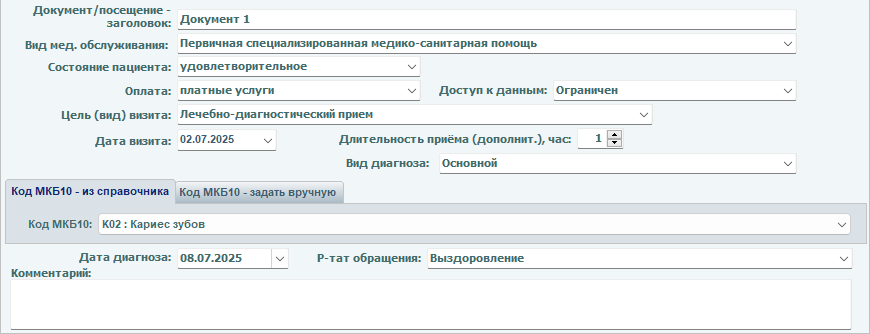

- Документ/посещение – заголовок  
   – поле ввода заголовка документа/посещения (по умолчанию "Отправка данных посещения")
- Вид мед. обслуживания  
   – изменяется в выпадающем меню (по умолчанию "Специализированная, в том числе высокотехнологичная, медицинская помощь");

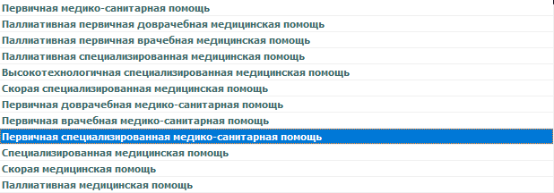

- Состояние пациента  
   – изменяется в выпадающем меню (по умолчанию "удовлетворительное");

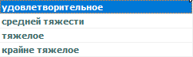

- Оплата  
   – изменяется в выпадающем меню (по умолчанию "платные услуги");

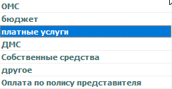

- Доступ к данным  
   – изменяется в выпадающем меню (по умолчанию "Ограничен");

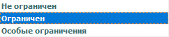

- Цель (вид) визита  
   – изменяется в выпадающем меню (по умолчанию "Лечебно-диагностический прием");

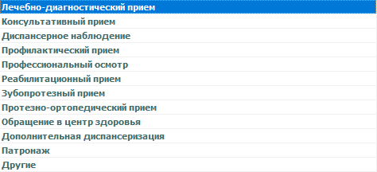

- Дата визита  
   – изменяется в выпадающем меню (по умолчанию дата последнего посещения);
- Длительность приёма (дополнит.), час  
   – изменяется кнопками «больше»-«меньше» в поле ввода, также доступен ручной ввод (по умолчанию "1");
- Вид диагноза  
   – изменяется в выпадающем меню (по умолчанию "Основной");

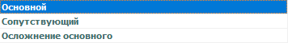

- Дата диагноза  
   – изменяется в выпадающем меню (по умолчанию дата «сегодня»);
- Результат обращения  
   – изменяется в выпадающем меню (по умолчанию «Выздоровление»).

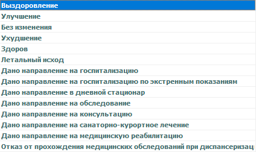

- Блок выбора из справочника/ввода вручную кода МКБ10: 
   Во вкладке выбора кода МКБ10 из справочника доступен выбор кода в выпадающем меню. Данное поле обязательное и необходимо выбрать из списка код по обращению пациента в клинику. Если необходимый код отсутствует в списке, то смените закладку на «Задать вручную» и укажите нужный код. – по умолчанию для данного поля выбрано значение «К02 : Кариес зубов», но также доступны следующие пункты:

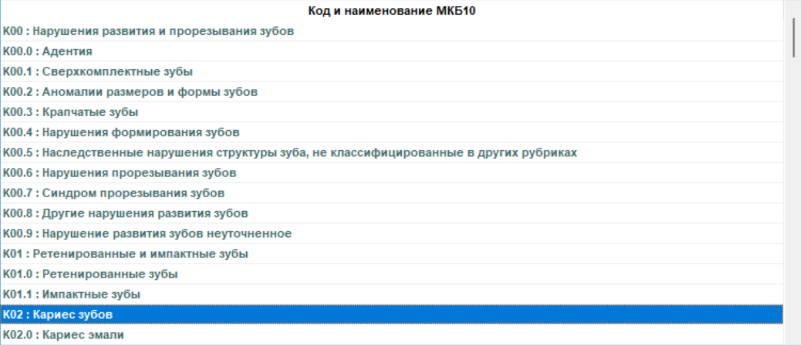
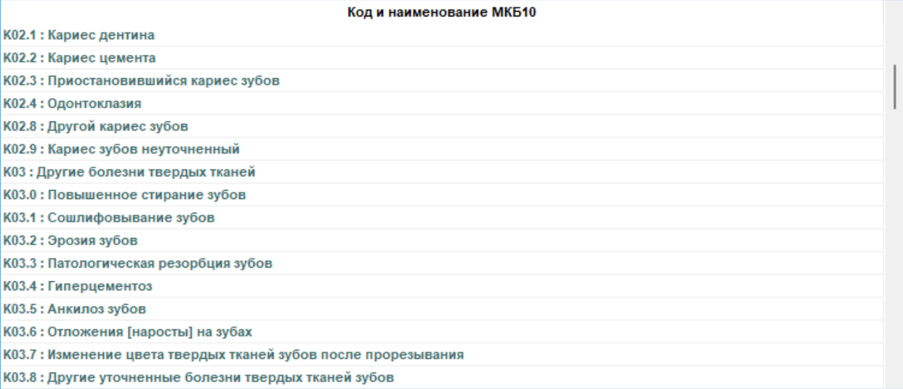
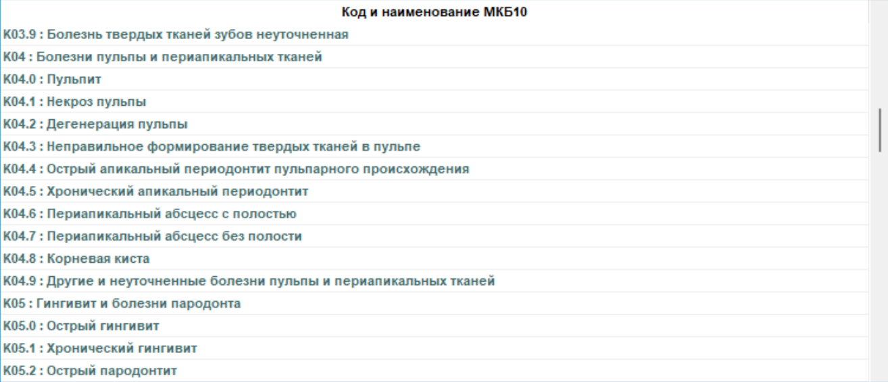
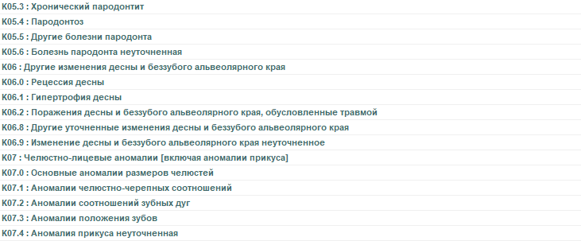
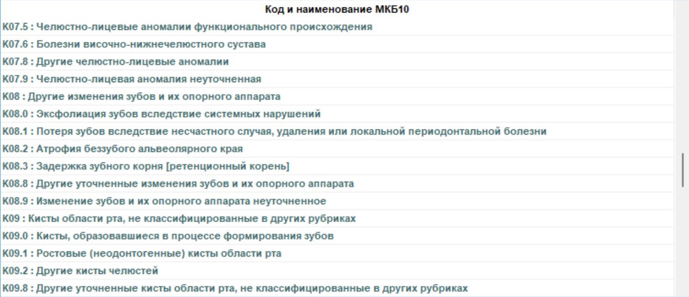
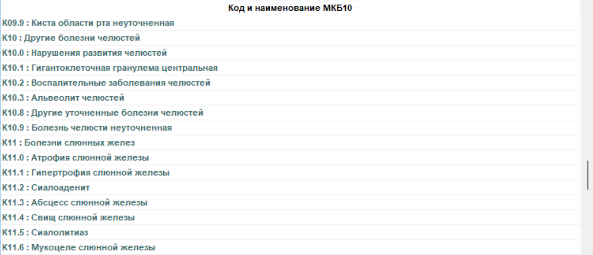
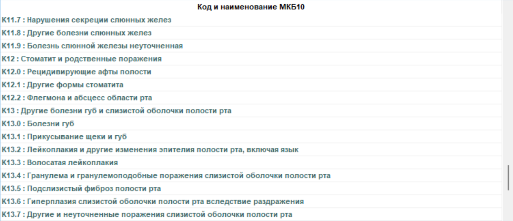
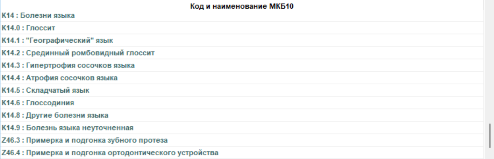 

Во вкладке ввода кода МКБ10 вручную – присутствуют два поля для ввода кода МКБ10 и диагноза соответственно.

  

## **Обязательные к заполнению поля, необходимые для отправки:**
### **Врачебный блок:**
   - Врач, СНИЛС № (вкладка «Данные - врач»);
   - Пользователь, ФИО (вкладка «Данные – пользователь ЕГИСЗ»)
   - Пользователь, СНИЛС № (вкладка «Данные – пользователь ЕГИСЗ»)
### **Блок результатов приёма:**
   - Код МКБ10;
   - Диагноз;

!!! warning "ВАЖНО"
    Врач, его СНИЛС и ДОЛЖНОСТЬ, а также аналогичные поля вкладки пользователя ЕГИСЗ должны совпадать с указанными в ЛК РосМинЗдрава и соответствовать сертификатам КриптоПро.

В случае успешной отправки выдается соответствующее сообщение.  Если при отправке возникают ошибки, выводится их описание, для подробного анализа в системе (по обращению к службе поддержки) может быть активирован служебный режим отладки отправки данных. Кроме того, файлы подписанного документа и подписей сохраняются в указанный в настройках каталог, а файл активной (текущей) отправки может сохраняться в каталог с программой iStom для анализа полей и данных на соответствие требованиям ЕГИСЗ (см. служ. галочка слева внизу окна).
  
В результате успешной передачи файла подписанного документа (с ЭЦП компании и врача) в ЕГИСЗ передается эпикриз приема пациента с необходимыми для записи в систему полями и данными карточки пациента, текущего или заданного перед отправкой диагноза, описания и пр. 
Для верификации отправки можно использовать выданный ЕГИСЗ доступ в eventlog (web форма журнала выгрузки данных в ЕГИСЗ) через защищенное соединение, либо по факту тестовой отправки обратиться в техническую поддержку iStom для подтверждения записи в ЕГИСЗ.
 
!!! warning "ВАЖНО"
    Успешная отправка в программе iStom НЕ ГАРАНТИРУЕТ добавления подписанного электронного цифрового документа (ЭЦД) в базу ЕГИСЗ, если данные в подписях и полях настроек ошибочные и не соответствуют полям из записей ЛК РосМинЗдрава!  

!!! info *Поле «Комментарий» не обязательное, поэтому заполнять его или нет решает сам врач.*
