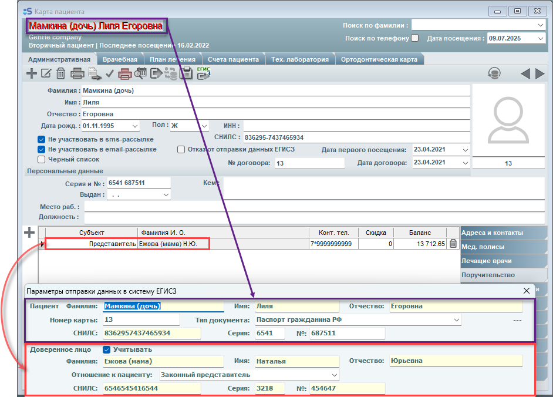

# Отправка данных о приеме несовершеннолетнего пациента
  При вызове окна Параметров отправки данных в ЕГИСЗ из карты пациента имеющего поручителя автоматически заполняются поля как показано на картинке ниже:
(Данные представителя автоматически заполняются в блоке "Доверенное лицо", данные подопечного – в блоке "Пациент" соответственно)

 

- **ФИО**;
- **Отношение к пациенту**  
  – изменяется в выпадающем меню (по умолчанию "Законный представитель");  
  Полный список, доступных к выбору отношений к пациенту, показан на скриншоте ниже:

