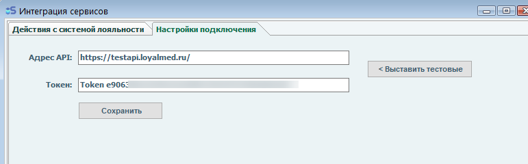
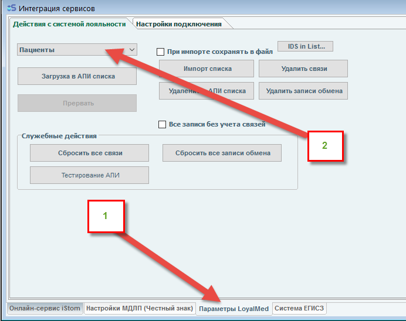
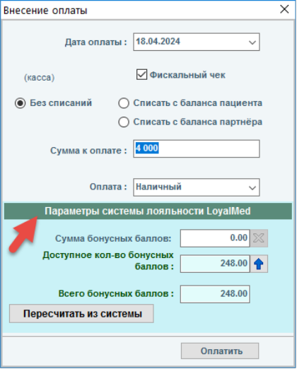

# Интеграция с LoyalMed

LoyalMed — внешняя система лояльности. Интеграция позволяет использовать бонусные баллы LoyalMed при оплате счетов пациентов в iStom.

## Требования для работы

1. У клиента iStom должна быть **подключена и активна учётная запись** в системе лояльности LoyalMed.

2. В технической поддержке iStom для клиента должен быть **активирован режим работы с LoyalMed** — в основном меню iStom должна появиться вкладка **«Параметры LoyalMed»** (раздел «Интеграция сервисов»).

3. Клиент задаёт **настройки подключения** к сервису LoyalMed в суб-вкладке «Настройки подключения» страницы «Параметры LoyalMed». Подключение к учётной записи iStom не требуется.

## Первоначальная загрузка данных

Для успешной работы с LoyalMed необходимо **последовательно загрузить** в систему:

1. Филиалы
2. Врачи
3. Пациенты

Действие выполняется в суб-вкладке **«Действия с системой лояльности»** на странице «Параметры LoyalMed». Выполняется **один раз**; при последующих нажатиях загружаются только недостающие записи.

!!! warning "Большое количество пациентов"
    Загрузка списка пациентов при более чем 5000 записей может занимать **10–15 минут**. Не рекомендуется прерывать процесс отправки.

## Работа с бонусами при оплате

- Программа iStom **не хранит** на своей стороне доступное количество бонусных баллов. Баланс запрашивается каждый раз при открытии окна оплаты.

- Если модуль интеграции активен, в **окне оплаты** появляется дополнительная панель с информацией от системы LoyalMed.

- Параметры можно обновлять и выставлять сумму бонусов для списания (сумма оплаты при этом уменьшается).

- При успешном добавлении оплаты в систему LoyalMed — выдаётся соответствующее сообщение.

