# Отправка напоминаний о приёме через MAX

Программа iStom позволяет отправлять пациентам напоминания о записи на приём прямо в MAX.

## Требования

- Наличие интернет-соединения
- В карте пациента должен быть указан **номер мобильного телефона, к которому привязан аккаунт в MAX**
- Пациент должен быть **записан на приём** к специалисту

## Настройка интеграции с MAX
### 1. Общие настройки -> Настройки MAX
В данном окне настройки MAX присутствуют поля, которые необходимо заполнить.
Для начала переходим по ссылке на основной сайт Green-API 

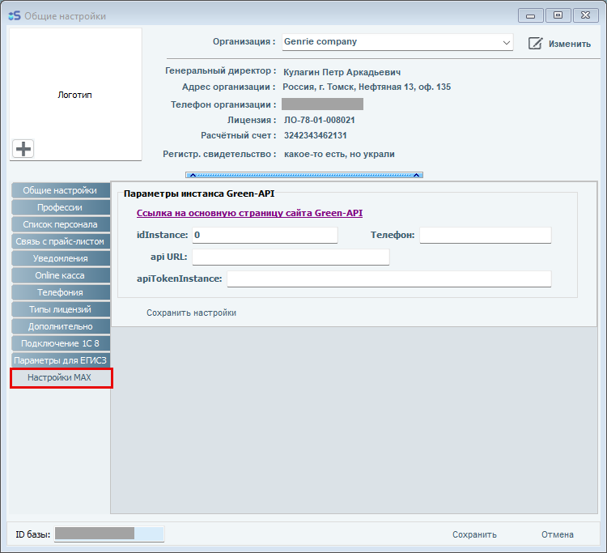

### 2. Вход в УЗ Green-API
Переходим на сайт [Green-API](https://green-api.com/) и регистрируемся, либо входим в свою учетную запись

[Инструкция по созданию аккаунта на Green-API](https://green-api.com/v3/docs/before-start/)

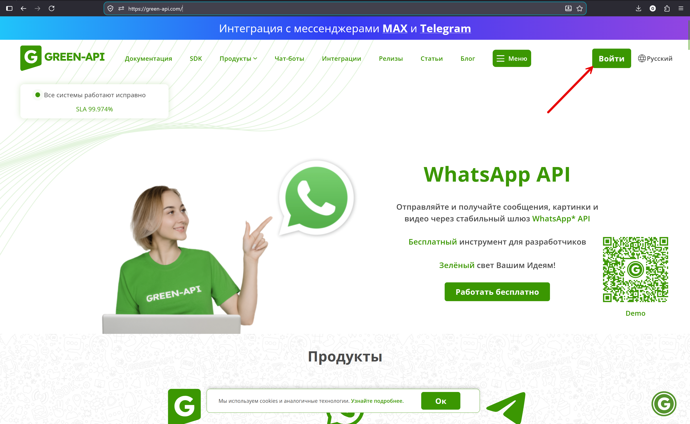

Также, пожалуйста, ознакомьтесь с информацией на странице [Как снизить риск блокировки в мессенджере MAX?](https://green-api.com/v3/docs/faq/how-to-reduce-risk-of-blocking/#max)

### 3. Создаем новый инстанс
После авторизации, в личном кабинете переходим в Инстансы -> Создаем инстанс, тариф MAX Business

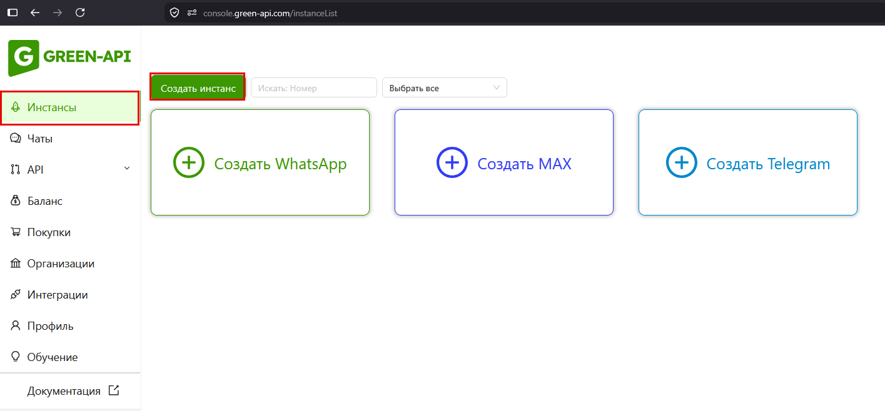

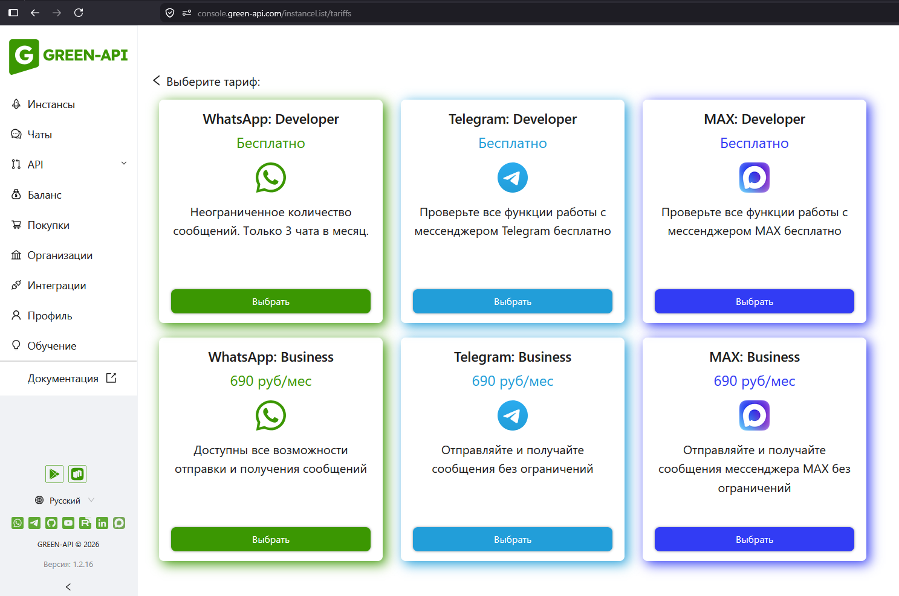

Оплачиваем необходимый для вас инстанс.

### 4. Ждем создания инстанса
На странице "Инстансы" ожидаем появления карточки созданного инстанса

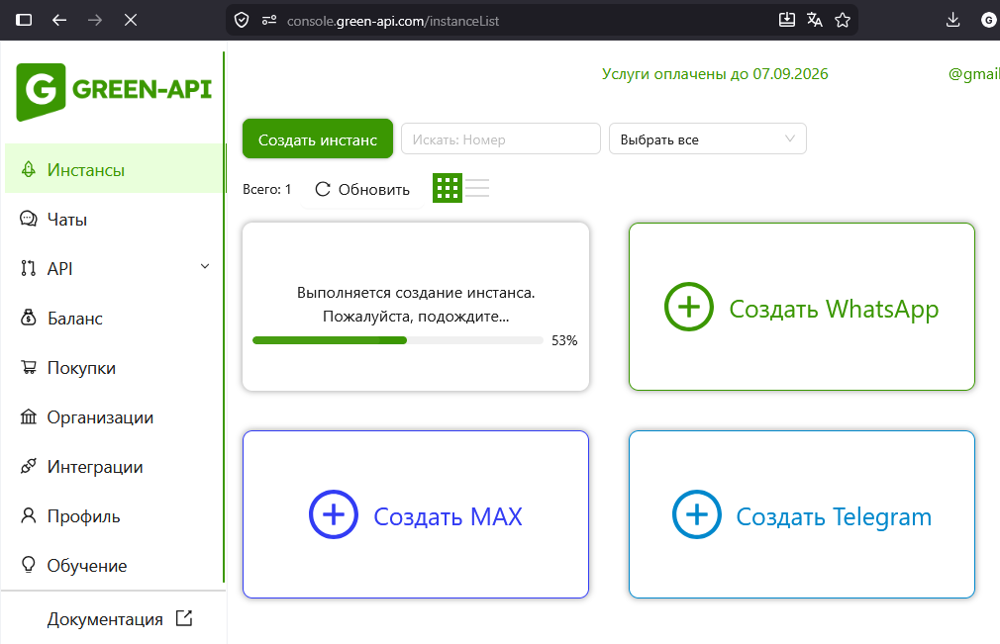

### 5. Подключаем MAX к Green-API
Когда созданный инстанс появился в списке, переходим на его страницу, нажав на него и по подсказкам ниже подключаем MAX.

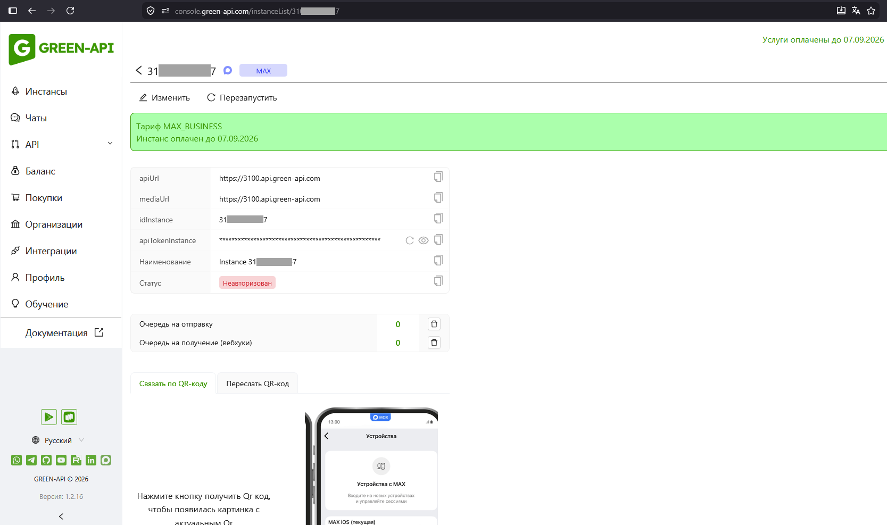

Также информацию по авторизации инстанса можно прочитать здесь [Авторизация инстанса](https://green-api.com/v3/docs/before-start/#authorization)

### 6. Проверяем статус авторизации в MAX
При успешном подключении MAX к Green-API статус инстанса сменится с "Неавторизован" на "Авторизован".
Также в правой части появится окно с чатами.

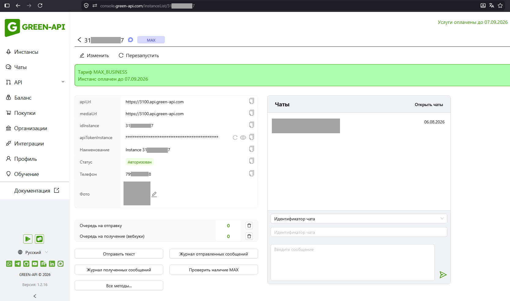

### 3. Настраиваем интеграцию с MAX в iStom
Параметры доступа к инстансу с сервиса Green-API необходимо скопировать и вписать в поля настройки MAX внутри ПО iStom (Общие настройки -> Настройки MAX )

| Поле в Green-API | Поле в iStom |
|---------|----------|
| apiUrl | api Url |
| idInstance | idInstance |
| Телефон | Телефон |
| apiTokenInstance | apiTokenInstance |

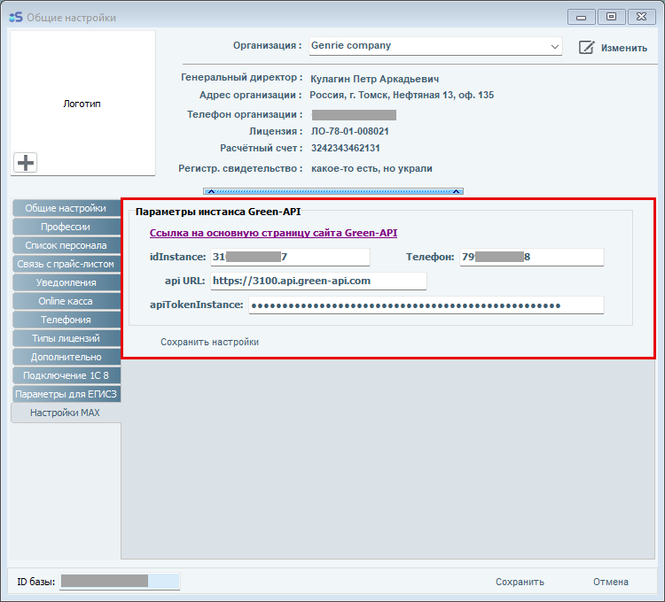

После заполнения полей необходимо обязательно сохранить настройки.

## Отправка уведомления в MAX
### Находим запись пациента в расписании и по нажатию на правую кнопку мыши выбираем "Сообщение в MAX"

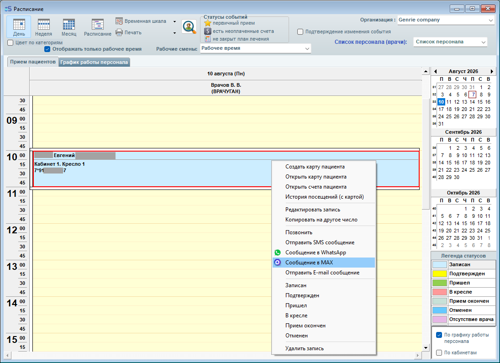

Если по номеру телефона пациента был найден аккаунт в MAX, то позитивным результатом отправки уведомления будет модальное окно с текстом "Отправлено ID="*************", где ID - идентификатор чата с пациентом в MAX.

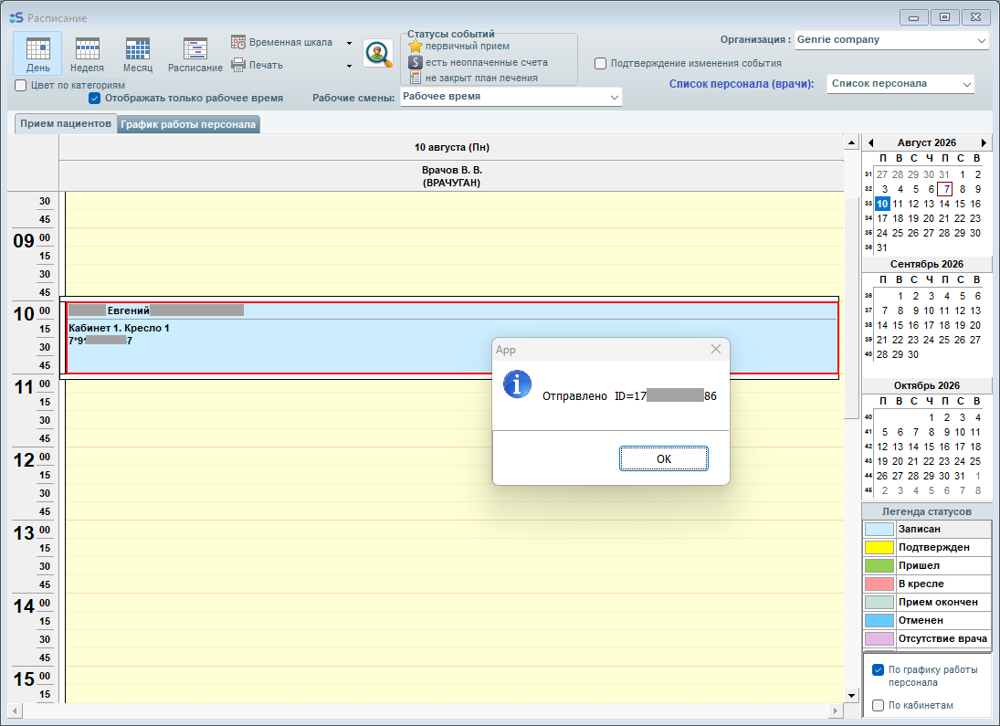

В системе Green-API непосредственно в созданном инстансе, либо в разделе "Чаты" - можно увидеть отправленное пользователю уведомление о предстоящем приёме.

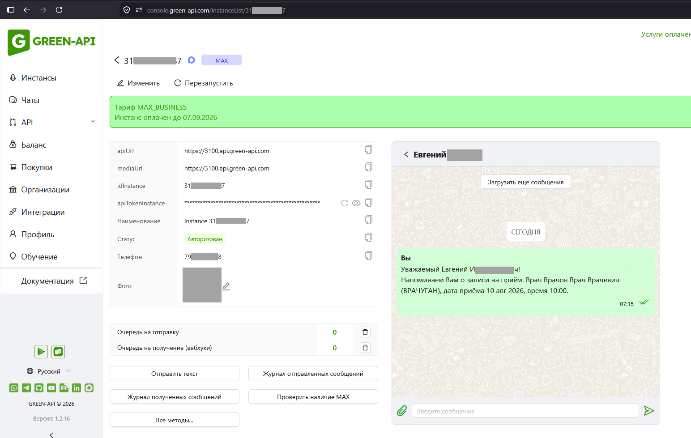

## Дополнительные ссылки
[Green-API: FAQ](https://green-api.com/v3/docs/faq/)

[Green-API: Перед началом работы](https://green-api.com/v3/docs/before-start/#_1)

[Green-API: Стоимость API мессенджера MAX](https://green-api.com/v3/docs/about-tariffs/#api-max)