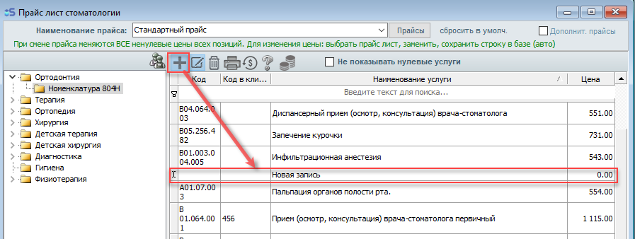
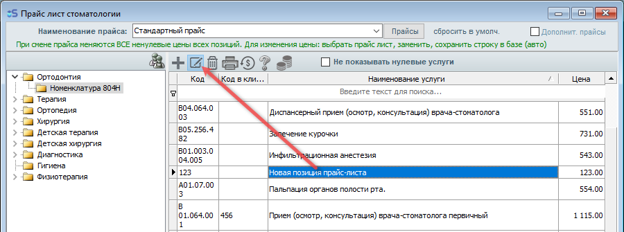
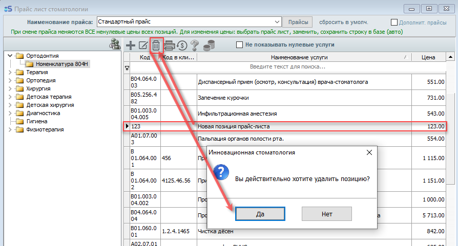

#### Какие функции есть в приложении.

1. Расписание

Тут вы можете посмотреть записи пациентов на любой день, а также записать новых, нажав на кнопку «Добавить запись» под расписанием.

2.Запись пациентов

Из расписания можно записать на приём как пациента с карточкой, так и нового пациента без карточки. Чтобы записать вторичного пациента - нажмите при записи на строку «пациент» и выберете из списка нужного,а чтобы записать нового пациента -- нажмите на строку «пациент», затем «Создать».

3.Список пациентов

Список пациентов открывается через выдвижное меню в левом верхнем углу (три горизонтальные полоски), вкладка \"Пациенты\". В списке пациентов есть возможность поиска пациента, нажав на \"воронку\" в правом верхнем углу.

Нажав, на интересующего пациента, можем посмотреть его личную информацию, а также его счета. Нажав на номер пациента в его личной информации открывается приложение для звонка.

Помимо уже имеющихся счетов, есть возможность создать новый счет пациента, для этого

-открываем его счета,

-нажимаем \"добавить\",

-затем \"плюсик\",

-выбираем тип услуги

-номенклатуру

-пункт номенклатуры, а самое главное (необходимо указать количество), иначе значение количества останется \"0\" и в общую стоимость не будет считаться.

-Нажимаем \"Сохранить\". Если необходимо добавить еще позиции в счёт - добавляем также как и первую, начиная с \"плюсика\".

-Если все необходимые позиции добавлены в счет - нажимаем \"Сохранить\" и счёт сформирован.

4.Чат

