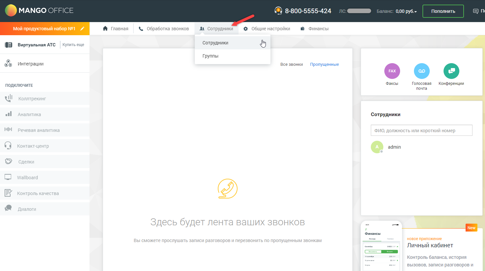
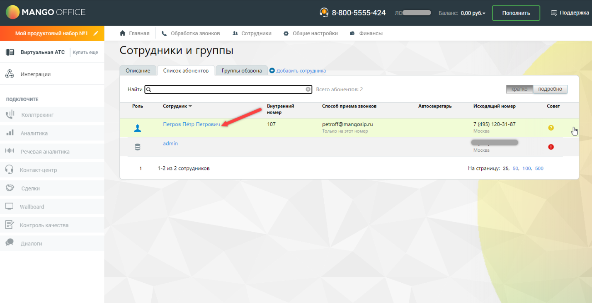
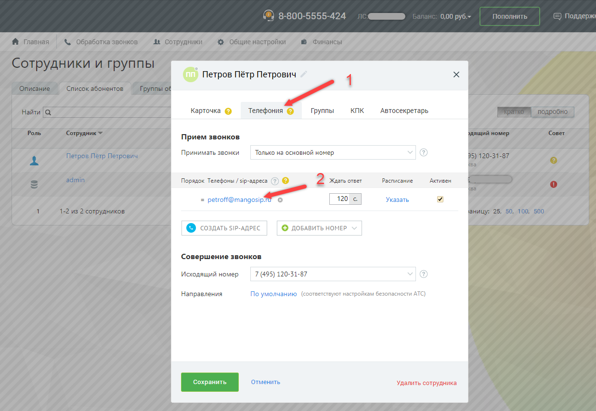
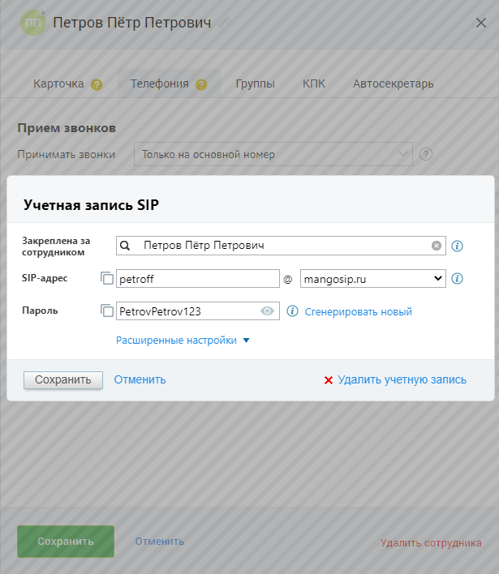
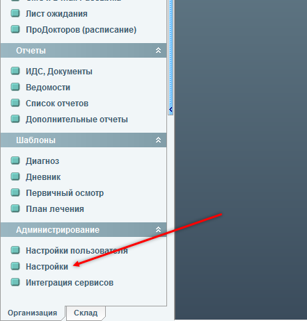
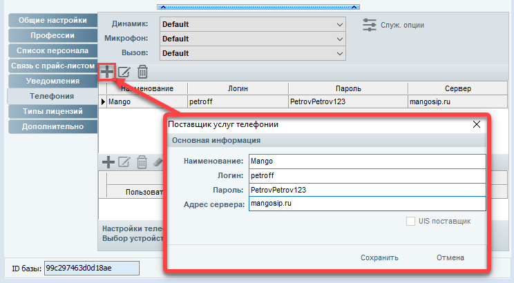
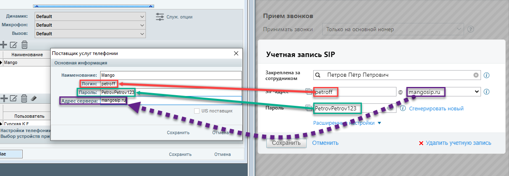
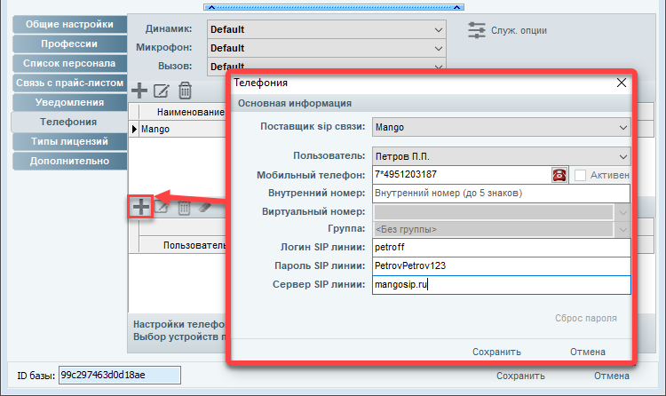
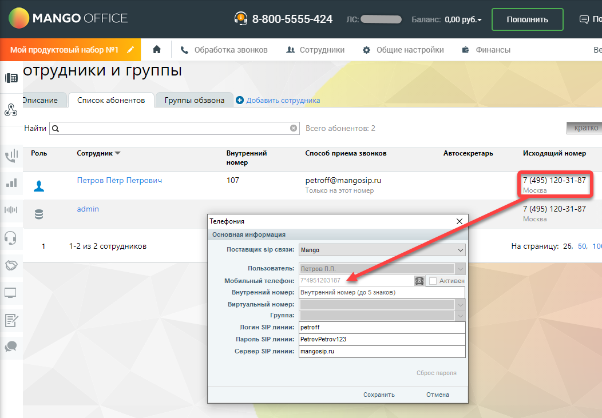

# Интеграция с Mango Office

Настройка телефонии с использованием Сервиса Mango

iStom - программа автоматизации стоматологии

Для подключения телефонии необходима установленная программа iStom Ultimate.

Необходимые данные для настройки телефонии с использованием сервиса Mango - можно найти в личном кабинете Mango

(где найти и какие данные - показано ниже на скриншотах) *ЛК Mango \--\> Сотрудники \--\> Выбираем сотрудника \--\> Телефония \--\> Открываем настройку учетной записи SIP:*

1. Заходим в основные настройки программы.

2. В окне настроек переходим в раздел "Телефония"

3. Далее создаем запись поставщика услуг. В качестве логина и пароля используем данные нужной виртуальной sip-линии  из Личного кабинета Mango (скриншоты ниже). В поле адреса сервера вводим: mangosip.ru

4. Следующим шагом добавляем запись Sip-линии. Указываем Поставщика sip связи, которого мы добавили в пункте 3. В поле «Пользователь» мы должны выбрать нужного пользователя программы iStom, за которым будет закреплена данная sip-линия. В поле «Мобильный телефон» указываем номер входящей линии подключенной к сервису Mango. Логин, пароль и сервер sip-линии указываем такие же как в пункте 3.

5. В окне настроек программы жмем кнопку «Сохранить». Настройка телефонии завершена.

-
-
