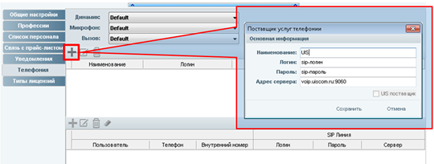
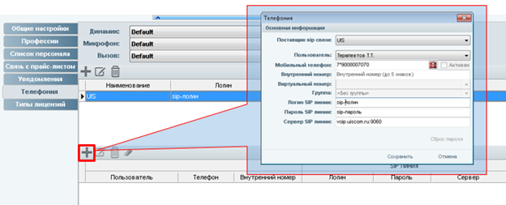

# Интеграция с UIS

#### Настройка телефонии с использованием Сервиса UIS.

iStom - программа автоматизации стоматологии

Для подключения телефонии необходима установленная программа iStom Ultimate.

1. Заходим в основные настройки программы

2. В окне настроек переходим в раздел "Телефония"

3. Далее создаем запись поставщика услуг. В качестве логина и пароля используем данные нужной виртуальной sip-линии  из Личного кабинета UIS. В поле адреса сервера вводим имя сервера и порт: voip.uiscom.ru:9060

4. Следующим шагом добавляем запись Sip-линии. Указываем Поставщика sip связи, которого мы добавили в пункте 3. В поле «Пользователь» мы должны выбрать нужного пользователя программы iStom, за которым будет закреплена данная sip-линия. В поле «Мобильный телефон» указываем номер входящей линии подключенной к сервису UIS. Логин, пароль и сервер sip-линии указываем такие же как в пункте 3.

5. В окне настроек программы жмем кнопку «Сохранить». Настройка телефонии завершена.
