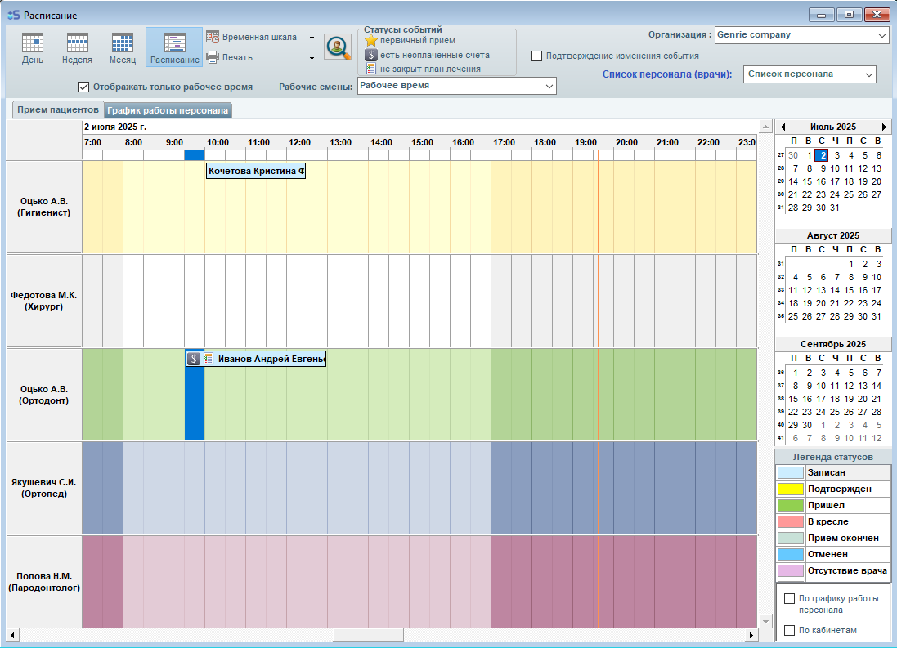
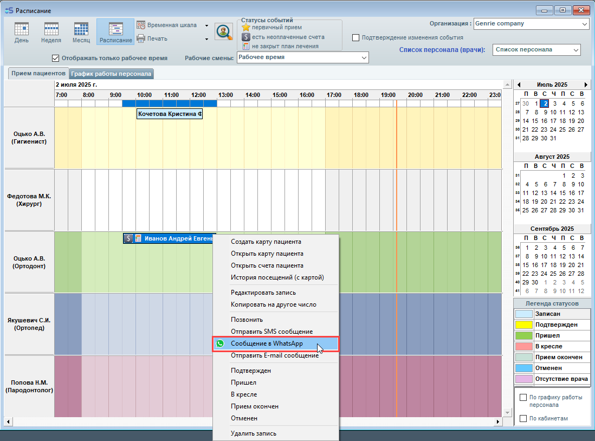
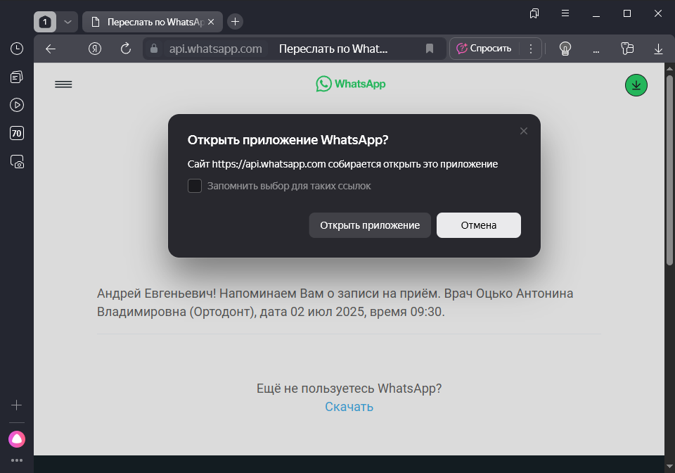
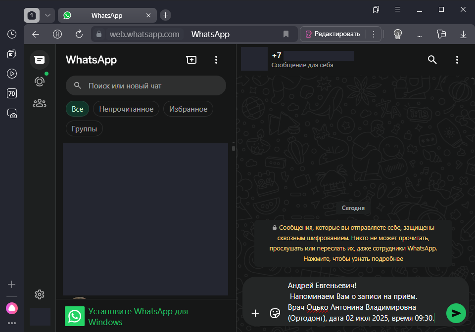
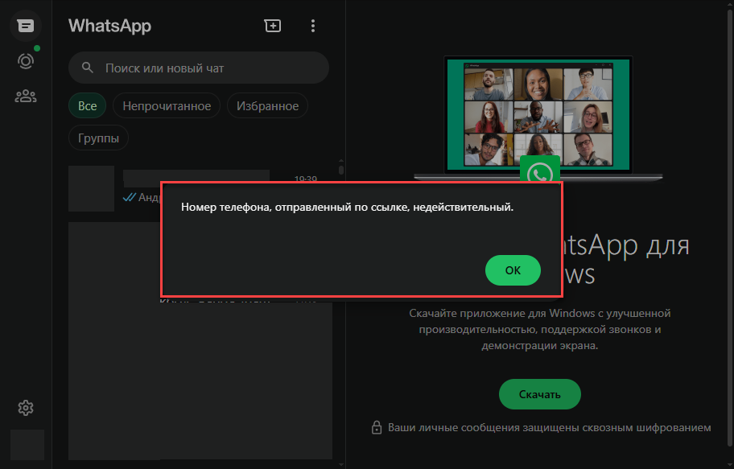
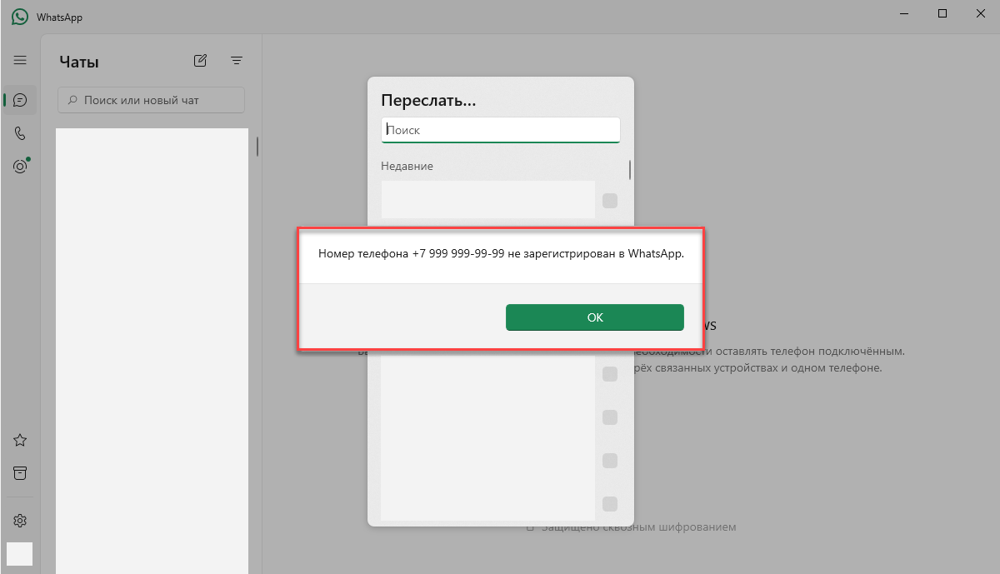

# Отправка напоминаний о приёме через WhatsApp

Программа iStom позволяет отправлять пациентам напоминания о записи на приём через WhatsApp — как через десктопное приложение, так и через веб-версию.

## Требования

- Наличие интернет-соединения
- В карте пациента должен быть указан **номер мобильного телефона**
- Пациент должен быть **записан на приём** к специалисту

## Варианты отправки

| Вариант | Описание |
|---------|----------|
| **WhatsApp Desktop** | Десктопное приложение, установленное на ПК |
| **WhatsApp Web** | Веб-версия через браузер |

Выбрать вариант можно непосредственно при подготовке к отправке или заранее.

## Пошаговая инструкция

### 1. Открыть расписание с записью пациента

### 2. Выбрать «Сообщение в WhatsApp»

В выпадающем меню записи пациента выберите пункт **«Сообщение в WhatsApp»**.

### 3. Выбрать вариант отправки

**Если WhatsApp Desktop НЕ установлен** — нажмите «Перейти в чат» (откроется браузер с WhatsApp Web):

**Если WhatsApp Desktop установлен** — нажмите «Открыть приложение»:

### 4. Отправить сообщение

**В веб-версии** откроется чат с пациентом в браузере:

**В десктопной версии** откроется чат в приложении WhatsApp:

Отправьте подготовленное сообщение пациенту.
