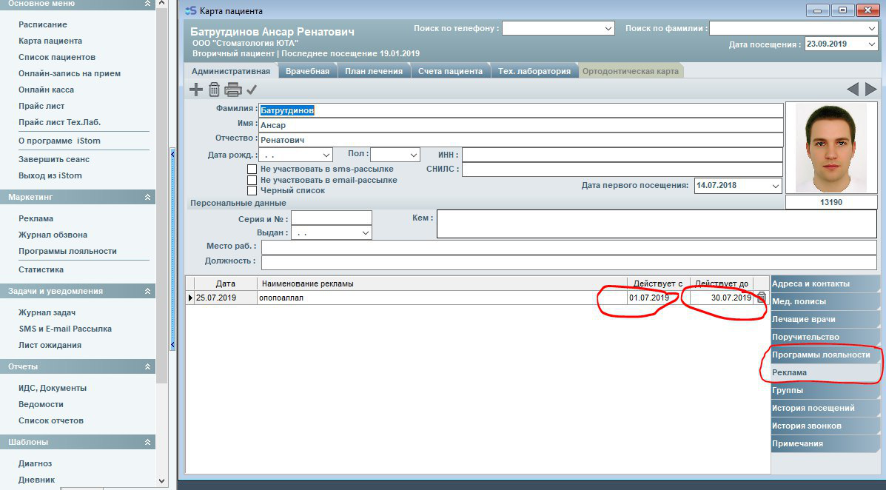
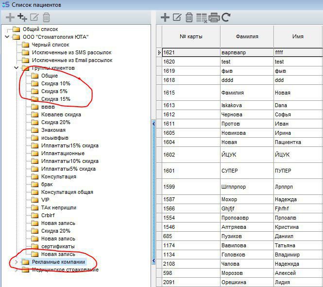

#### Автоматическое начисление скидок и акций пациенту. Бонусная система.

Привязка к пациенту определенной бонусной группы дает возможность рассчитать скидку в счете автоматически, с учетом условия бонусной программы. В бонусной программе требуется привязать пациента к группе. Проставленные галочки - это активные группы.

Далее, создаем рекламную компанию, или бонусную программу, в административной части карты пациента, выбираем программу лояльности или рекламную компанию в которой участвует пациент.

При правильном выборе рекламы или бонусной программы, пациенты автоматически попадают в группу (раздел список пациентов).

При активной программе  - скидки и бонусы начисляются автоматически
