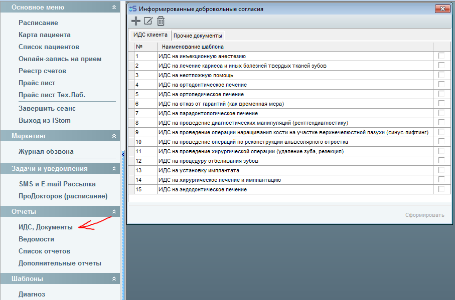
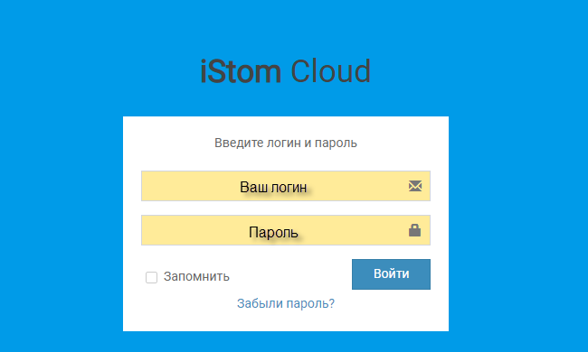
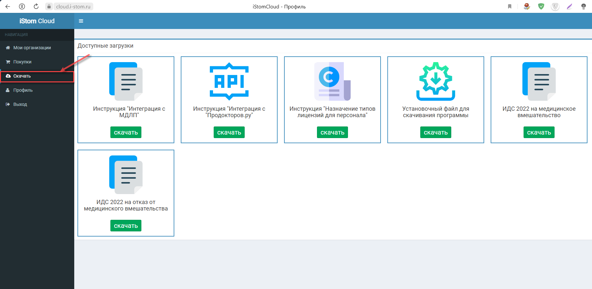
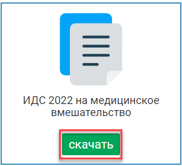
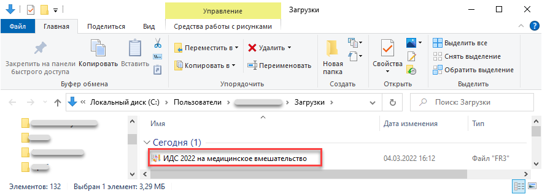
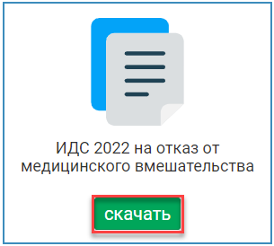
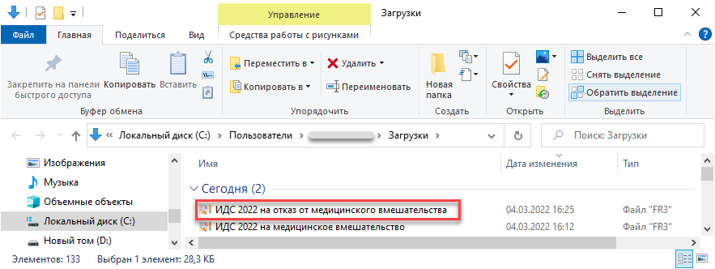
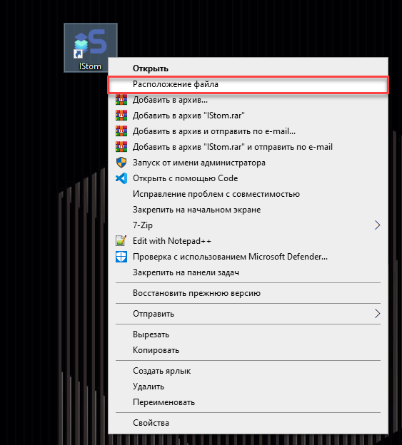
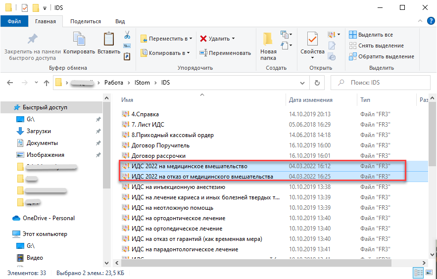

# Информированное добровольное согласие (ИДС)

---

## Информированное добровольное согласие (ИДС)

#### Информированное добровольное согласие (ИДС).

Сейчас в программе имеются 15 ИДС документов.

Найти эти ИДС можно в меню слева, вкладка "ИДС, Документы".

Кроме использования существующих шаблонов, вы можете добавлять свои документы "ИДС клиента" и редактировать имеющиеся, а также добавлять новые и изменять уже имеющиеся "Прочие документы".

---

## Как обновить ИДС

#### Как обновить ИДС о медицинском вмешательстве на 2022 год?

Для того, чтобы добавить в программу актуальные ИДС о медицинском вмешательстве на 2022 год необходимо:\
1. Зайти в [личный кабинет iStom](https://cloud.i-stom.ru/login).

2. В меню открыть вкладку "Скачать".

3. Нажать кнопку "Скачать", которая находится под файлом "ИДС 2022 на медицинское вмешательство".

4. Открыть папку с сохраненным файлом и переименовать его на "ИДС 2022 на медицинское вмешательство".

5. Нажать кнопку "Скачать", которая находится под файлом "ИДС 2022 на отказ от медицинского вмешательства".

6. Открыть папку с сохранённым файлом и переименовать его на "ИДС 2022 на отказ от медицинского вмешательства".

7. Открыть папку с файлами iStom (это можно сделать через ярлык программы, как показано на скриншоте):

8. В открывшейся папке с программой находим и открываем папку IDS, а затем копируем туда два файла, которые мы сохранили из личного кабинета:

9. Теперь новые ИДС на медицинское вмешательство будут отображаться в программе:

-
-

---

## Не отображаются ИДС и договора

#### Не отображаются ИДС и договора.

Для отображения ИДС и договоров нужно указать путь к документам в настройках программы.

Путь по умолчанию:

Договора: .\\IDS\\

Путь к файлам снимков: .\\Upload\\

Если вы пользуетесь по сети, желательно использовать YandexDisk или GoogleDrive для хранения и синхронизации ваших документов.

---

