# Шаблоны документов

---

## Детский договор

Есть ли у вас детский договор?

Да, детский договор присутствует в программе.

Для создания договора в Карте пациента вписывается законный представитель, а также в программе есть детская формула зубов.

---

## Как добавлять и редактировать договора

Как добавлять и редактировать договора?

С программой iStom поставляется базовый шаблон договоров и некоторых ИДС. Клиент вправе изменять шаблоны по своему усмотрению. Для доступа к шаблонам договоров необходимо зайти в раздел "ИДС, Документы" на панели главного меню. В данном разделе можно просматривать и редактировать шаблоны документов.

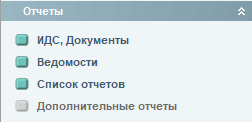

Если по каким-либо причинам вам необходимо изменить шаблон ИДС - пояснения к редактированию шаблонов есть в видеоинструкции \--\>\>(https://youtu.be/3VPn4KwMOhE?t=4985)\<\<\--.

!!!В качестве формата шаблонов программа iStom использует формат отчетности FastReport.!!!

> СОЗДАНИЕ ШАБЛОНА

Для того чтобы добавить в программу свой ИДС необходимо открыть окно ИДС, Документы, затем нажать на кнопку добавить и в открывшемся редакторе создать документ, который вы хотите использовать в дальнейшем (информацию по созданию текста в шаблонах и прочих элементов можно найти ниже, в разделе редактирования шаблонов):

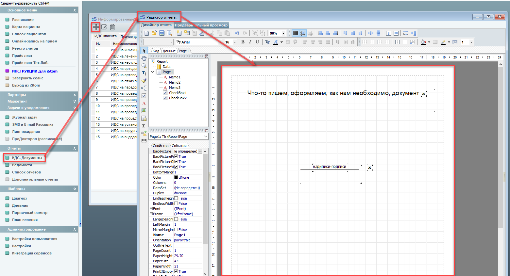

После того, как ваш документ будет готов - нажимаем "сохранить" и указываем папку для сохранения \...\...../IStom/IDS :

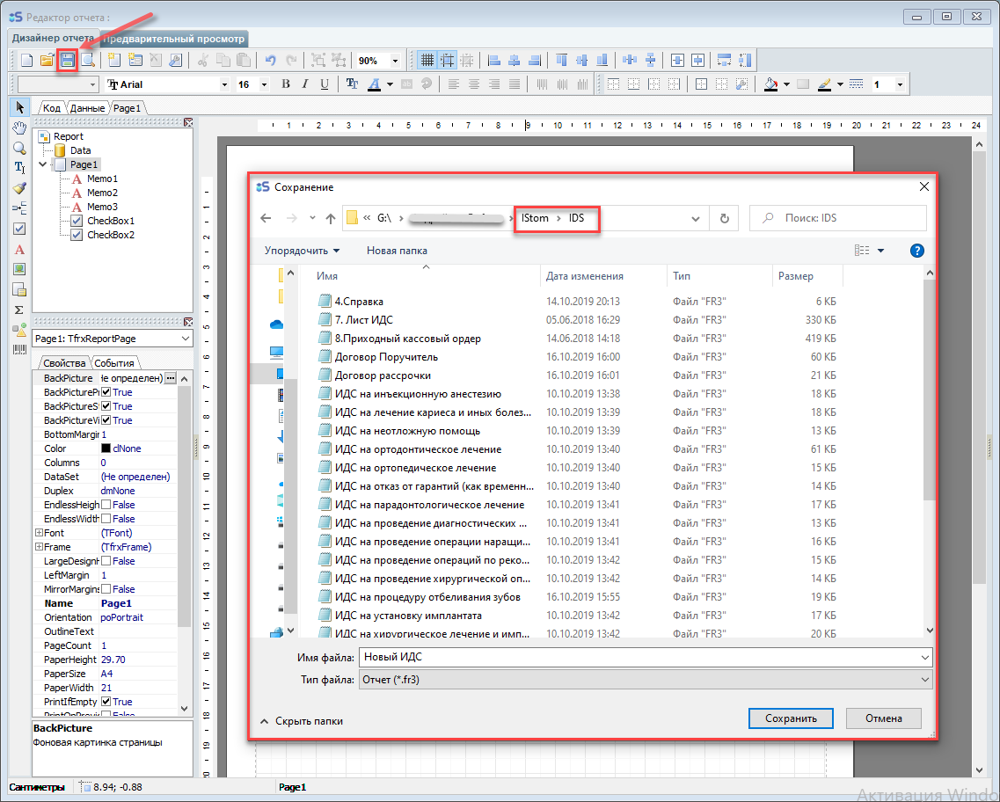

Обратите внимание на название файла, которое вы пишете: если название файла будет начинаться с больших букв ИДС, например: "ИДС новый" - тогда ваш шаблон будет отображаться во вкладке "ИДС клиента", а если название будет иным - тогда ваш шаблон будет находиться во вкладке "Прочие документы".

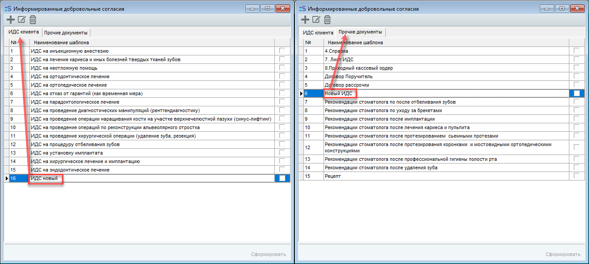

После того, как шаблон сохранён - его можно использовать.

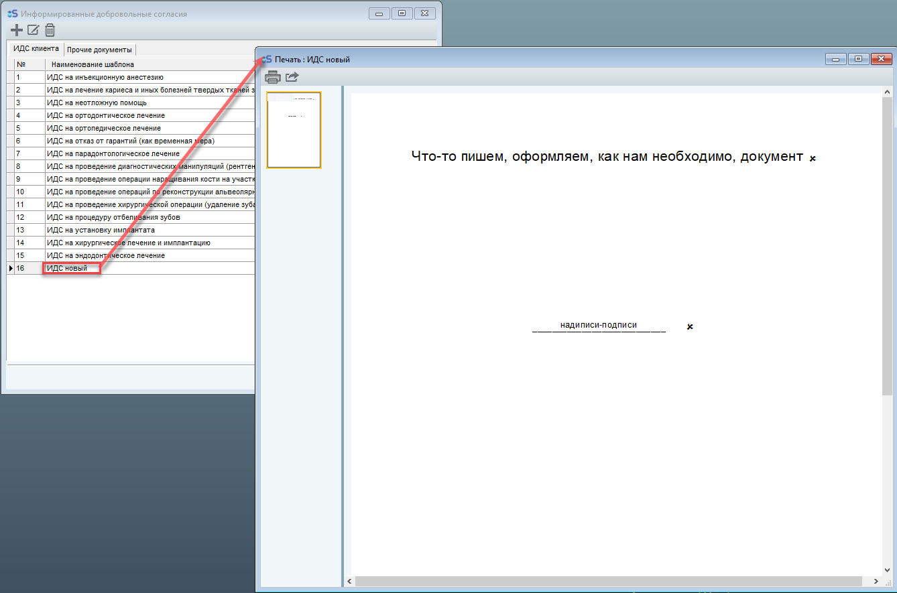

> РЕДАКТИРОВАНИЕ ШАБЛОНА

Также вы можете настроить ИДС сами при помощи данной инструкции в формате текста и скриншотов:

Раздел «ИДС, Документы» на панели главного меню, выбираем необходимый к редактированию ИДС и нажимаем на значок редактирования.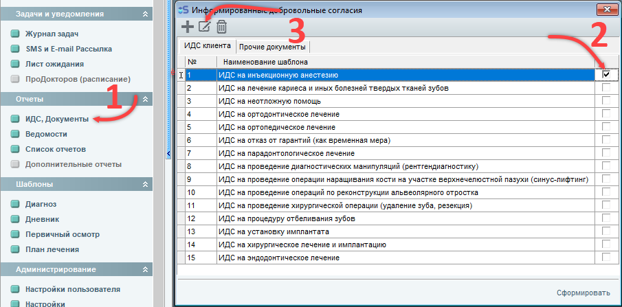

Так как шаблоны состоят из блоков -- поэтому редактирование и создание собственных шаблонов не такой уж сложный процесс.

При редактировании шаблона можно сразу смотреть документ в предварительном просмотре не сохраняя..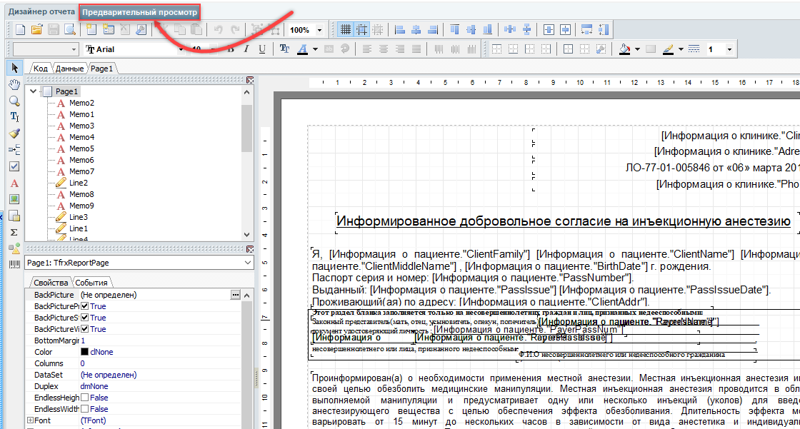

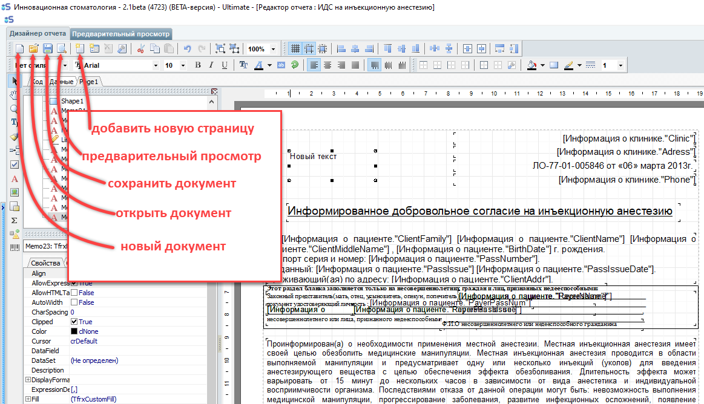

Для редактирования текста необходимо два раза нажать на левую кнопку мыши в блк, в котоом находится текст

Для создания нового блока с текстом необходимо нажать на панели слева на заглавную букву «А», а затем выбрать место на листе, где будет располагаться текст.

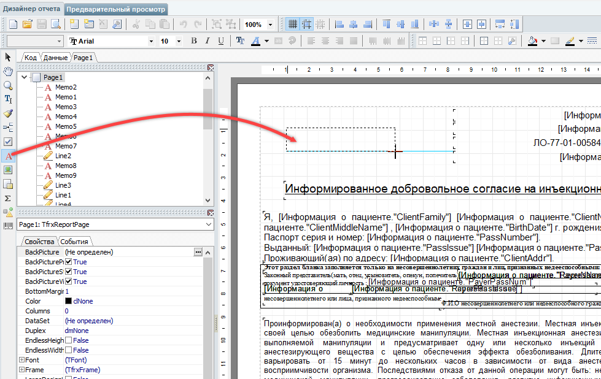

Для удобства и универсальности документа -- в редакторе есть поля базы данных (Поля БД).

Поля БД предназначены для того, чтобы текст документа для каждого пациента был разным, а именно ФИО, дата рождения и прочая личная информация.

Поля БД добавляются в поле документа простым перетягиванием левой кнопкой мыши.

ОБРАЩАЙТЕ ВНИМАНИЕ на то, что добавляемые поля БД имеют длину, которая не всегда оправдана (к примеру вы знаете, что фамилий длинной в половину строки нет -- поэтому оставляем под поле фамилии разумное количество символов, НО, если вы сделаете Поле БД слишком коротким, тогда вылезающие за границу блока символы обрежутся).

Поля БД информации о пациенте и информации о клинике сделаны интуитивно понятными для использования. (К примеру вы можете добавить текстовое поле "Здравствуйте, Уважаемый ---", а затем справа с панели "Поля БД" перетянуть Client Family, Client Name, Client MiddleName на лист поверх подчеркивания, чтобы информация из базы данных автоматически вставлялась поверх оставленного нами в тексте места. В таком случае мы получим готовую строку с текстом, в которую автоматически будет вставляться ФИО пациента.)

Вот как должно получиться:

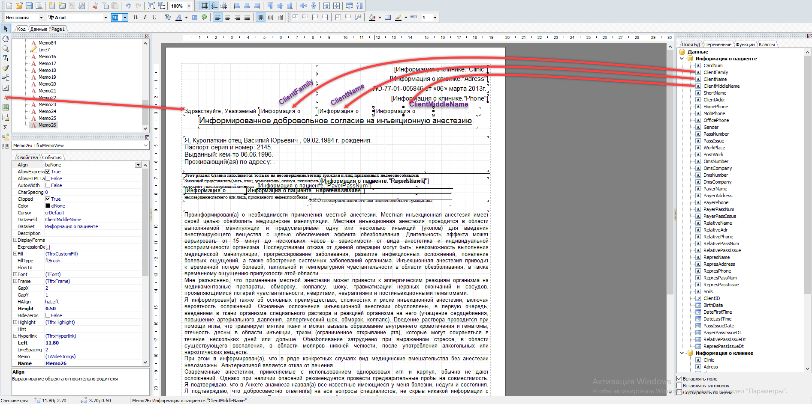

В предварительном просмотре:

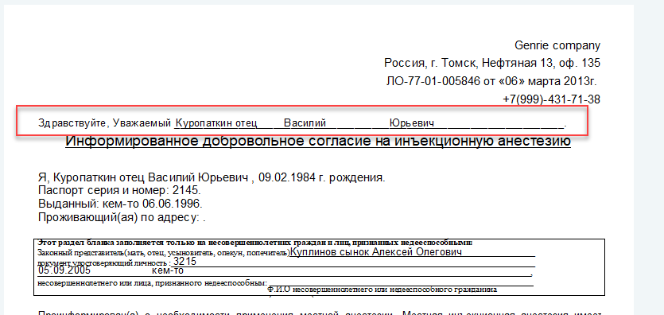

Поля БД (ПОЯСНЕНИЕ):

Информация о пациенте

CardNum - Номер карты.

ClientFamily - Фамилия.

ClientName - Имя.

ClientMiddleName - Отчество.

ShortName - Фамилия И.О.

ClientAddr - Адрес.

HomePhone - Домашний телефон.

MobPhone - Мобильный телефон.

OfficePhone - Рабочий телефон.

Gender - Пол.

PassNumber - Серия и номер паспорта.

PassIssue - Кем паспорт выдан.

WorkPlace - Место работы.

PostWork - Должность.

OmsNumber - Номер ОМС полиса.

OmsCompany - Страховая компания ОМС.

DmsNumber - Номер ДМС полиса.

DmsCompany - Страховая компания ДМС.

PayerName - Имя плательщика.

PayerAddres - Адрес плательщика.

PayerPhone - Номер телефона плательщика.

PayerPassNum - Серия и номер паспорта плательщика

PayerPassIssue - Кем выдан паспорт плательщика.

RelativeName - Имя подопечного.

RelativeAdr - Адрес подопечного.

RelativePhone - Номер телефона подопечного.

RelativePassNum - Серия и номер паспорта подопечного.

RelativePassIssue - Кем выдан паспорт подопечного.

RepresName - Имя представителя.

RepresAddress - Адрес представителя.

RepresPhone - Номер телефона представителя.

RepresPassNum - Серия и номер паспорта представителя.

RepresPassIssue - Кем выдан паспорт представителя.

Snils - Снилс.

ClientID - Номер клиента.

BirthDate - Дата рождения.

DateFirstTime - Дата первого посещения.

DateLastTime - Дата последнего посещения.

PassIssueDate - Дата выдачи паспорта.

PayerPassIssueDt - Дата выдачи паспорта плательщика.

RelativePassIssueDt - Дата выдачи паспорта подопечного.

RepresPassIssueDt - Дата выдачи паспорта представителя.

Ифнормация о клинике

Clinic - Наименование клиники.

Adress - Адрес.

Phone - Телефон.

BIC - БИК.

INN - ИНН.

KPP - КПП.

Account - Расчетный счёт.

Certif - Свидетельство.

DateCertif - Дата выдачи свидетельства.

OGRN - ОГРН.

GenDir - Генеральный директор.

LICENSE - Лицензия.

BranchID - Идентификатор (1-клиника, 2-филиал).

LicenseWho - Кем выдана лицензия.

Brief - Сокращение наименования.

BankName - Наименование банка.

Если все же вам не удалось самостоятельно создать или изменить необходимый вам документ - вы можете обратиться в отдел продаж iStom. +7 (499) 685-49-75 order@i-stom.ru

-
-

---

## Как создавать и редактировать шаблоны

#### Есть ли возможность создавать пользовательские шаблоны документов? Насколько сложно это сделать?

Вы можете создавать пользовательские шаблоны, но Вы должны уметь пользоваться редактором и иметь специальные навыки работы с FastReport.

---

## Справка в налоговую

#### Есть ли у вас справка в налоговую?

Да, в программе можно распечатать справку в налоговую. Для её печати нужно зайти в раздел "Карта пациента", нажать на кнопку принтера () и выбрать пункт "справка в налоговую".

---

