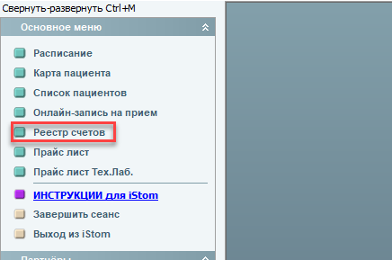
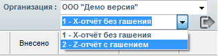
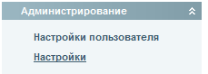
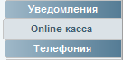

# Cashier

---

## касса_Z и X - отчёты. Как открыть и закрыть смену

#### Z и X - отчёты. Как открыть и закрыть смену?

Открытие смены происходит после первого чека.

Во время работы, не закрывая смену есть возможность распечатать X-отчёт. Х-отчёт - это информационный отчёт без закрытия смены

Смена закрывается с помощью итогового за день Z-отчёта. Для этого нужно зайти в раздел \"Реестр счетов\"  в главном меню и выбрать \"Z - отчет с гашением\". Чтобы закрыть смену, нужно выбрать \"Z-отчет с гашением\" и поставить галочку на смене, которую нужно закрыть.

*Если не закрыть смену в конце дня - в новой смене чеки печататься НЕ БУДУТ.*

Также в нашей программе  есть много реестров счетов по различным критериям.

Все отчеты печатаются только на кассу!

---

## касса_сменить кассира

#### Как сменить кассира в программе?

Для смены кассира необходимо зайти в раздел \"Настройки\", выбрать пункт \"Онлайн-касса\" и в редакторе кассового аппарата выбрать пользователя, которого Вы хотите назначить кассиром. После этого нужно зайти в программу под новым кассиром.

Смена ФИО кассира, которые печатаются в чеке, происходит через драйвер ККМ (как это сделать, вам подробно расскажут специалисты ЦТО, обслуживающего вашу кассу).

---

## касса_сделать выгрузку выручки за определенный период времени

#### Как сделать выгрузку выручки за определенный период времени?

Для того, чтобы сделать выгрузку, необходимо зайти в пункт \"Ведомости\" в меню слева и после этого выбрать раздел \"Организация\". Далее Вам нужно выбрать период в открывшемся окне сверху. Для печати ведомости необходимо нажать кнопку \"Печать\" ().

Подробнее о работе пункта \"Ведомости\" Вы можете узнать в полной инструкции.

---

