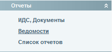
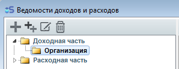
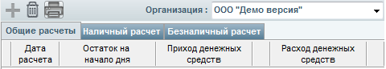

# Реестр счетов

---

## Где находятся реестры счетов

#### Где находятся реестры счетов?

С версии 2.0 и выше реестры находятся в меню "Ведомости" в разделе "Прочие ведомости".

---

## Реестр наличных и безналичных платежей

#### Как в реестре счетов вывести информацию о том, сколько средств было получено наличным, а сколько - безналичным путем?

Для вывода информации необходимо зайти в раздел "Ведомости", открыть раздел "Доходная часть" и выбрать подраздел "Организация". В данном разделе находятся вкладки "Общие расчеты", "Наличный расчет" и "Безналичный расчет". Нажимаем кнопку печать, и после этого кнопку "Экспорт".

---

