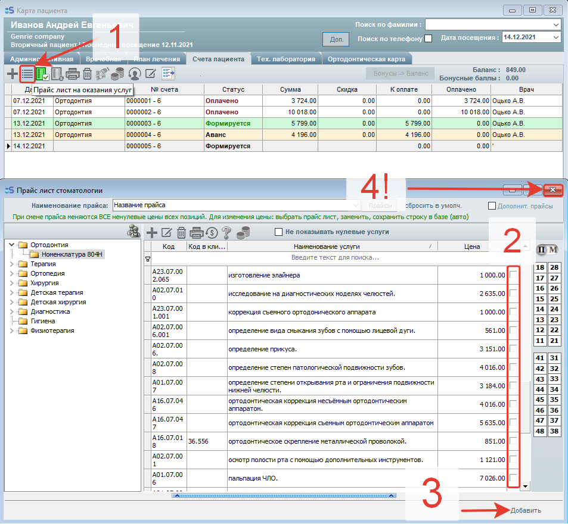
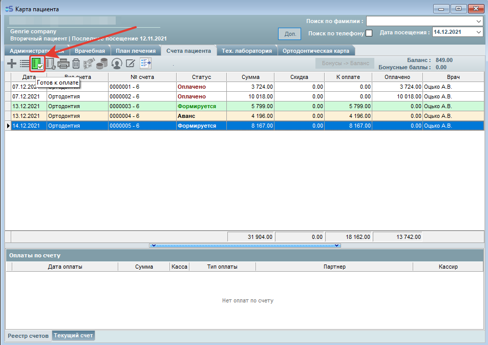
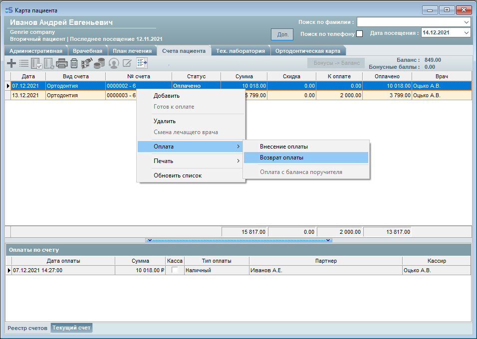

# Счета пациента

---

## Счета пациента

#### Счета пациента, виды оплаты и как оплачивать.

> Формирование счёта для оплаты

В программе iStom реализована удобная система оплаты счетов пациента.

Сформировать счёт для оплаты можно двумя способами:

1. В карте пациента вкладка "План лечения".

2. В карте пациента непосредственно во вкладке "Счета пациента".

❗️❗️❗️ Прочитать про закрытие смены вы можете в инструкции по ссылке:

<http://istom.usedocs.com/article/7274> "Z и X - отчёты. Как открыть и закрыть смену?" ❗️❗️❗️

О втором способе подробнее:

1. Добавляем пустой счёт

2. Добавляем позиции в счёт

> 1 - открываем Прайс лист;
>
> 2 - Отмечаем галочкой необходимые позиции;
>
> 3 - Добавляем позиции в счёт (НУЖНО НАЖАТЬ ОДИН РАЗ);
>
> 4 - Закрываем Прайс лист.

Каждая строка подсвечена своим цветом, который зависит от статуса счёта:\
"Формируется" - статус счёта, который еще не сформирован, в него всё еще можно добавлять позиции, но ПОКА СЧЁТ ФОРМИРУЕТСЯ - ЕГО НЕЛЬЗЯ ОПЛАТИТЬ!

Чтобы провести оплату по счёту - необходимо изменить статус счета с "Формируется", на "Аванс".

Для этого необходимо нажать кнопку "Готов к оплате" на панели сверху.

"Аванс" - статус счёта, который уже сформирован и готов к оплате, либо не полностью оплачен.

Строки, которые не подсвечиваются - имеют статус "Оплачено" - такой счёт уже ПОЛНОСТЬЮ оплачен или закрыт.

УДАЛЕНИЕ счетов также доступно! Для удаления счетов со статусами "Формируется" и "Аванс" (Если еще не вносилась оплата по счёту) - необходимо выделить необходимый счёт, нажать на него правой кнопкой мыши, затем "Удалить" (*либо нажать на кнопку "корзина" на панели вверху*) и подтвердить удаление.

Также можно удалить неполностью оплаченый и полностью оплаченый счёт, но перед удалением такого счёта программа предупредит вас о том, что при удалении могут возникнуть расхождения сумм в ведомостях, поэтому правильно будет сделать возврат той суммы, которая указана в оплате, а уже после возврата удалить счёт!

 

❗️❗️❗️ Прочитать про закрытие смены вы можете в инструкции по ссылке:

<http://istom.usedocs.com/article/7274> (Z и X - отчёты. Как открыть и закрыть смену?) ❗️❗️❗️

> Виды оплат:

1. Оплата наличными;

2. Оплата банковской картой (через терминал);

3. Безналичная оплата (перевод средств на счёт);

4. Кредит - это случай, при котором пациент не оплатил счёт до конца, и от него требуется последующая оплата (кредит).

Например, клиент оплатил 4 тысячи рублей из 7 тысяч. После этого он будет должен ещё 3 тысячи рублей. В чеке будет написан итог: общая сумма счета - 7 тысяч. Поступило - 4 тыс.

Сумма не совпадает потому, что был выбран тип оплаты "Кредит".\
*В налоговую идут 2 вида оплаты - картой или наличными*. Посмотреть данные о сумме, которая ушла в налоговую, можно в Z-отчёте.\
Команда IStom не проводит обучение бухгалтерскому делу.

> Как оплачивать счета:

Как описано выше -\> Чтобы провести оплату по счёту - необходимо изменить статус счета с "Формируется", на "Аванс".

Нажмите один раз левой кнопкой мыши на строку со счётом, который надо оплатить, затем на панели сверху выберите "Внесение оплаты"

 - вот такой значок, далее выбираем пункт "Внесение оплаты" и открывается окно оплаты счёта, в котором необходимо выбрать каким образом будет произведена оплата и вид оплаты, далее ввести сумму, которую вносит пациент (*по умолчанию при открытии окна в строку "Сумма к оплате" записывается* сумма  необходимая к оплате для полного закрытия счёта), после чего нажимаем "Оплатить" и если счёт оплачен полностью - статус счёта изменится с "Аванс" на "Оплачено".

---

## Счёт и врач

#### Почему при формировании счета, при выборе из прайс-листа, программа требует добавить врачей других специализаций?

Это связано с тем, что ваш счет открыт под конкретных лечащих врачей (например, под терапевта), и если нет необходимых врачей во вкладке "Лечащие врачи" (например, хирургов), вы не сможете добавить позиции из хирургии, то есть необходимо добавить врачей подходящих специальностей во вкладку "Лечащие врачи" в разделе "Карта пациента".

---

## Вид прайс-листа

Вид прайс-листа.

Раздел "Прайс-лист" предназначен для настройки прайс-листов. В комплекте идет стандартный набор позиций прайс-листов. У вас есть возможность создания своих прайсов без ограничения - это система мультипрайс.

1. Вы можете создать главный уровень прайс-листа.

2. Далее можно добавить подуровень или множество подуровней, например VIP, бюджетники, Акции.

Само внесение позиции прайса уже осуществляется через отдельный пункт меню - "Прайс лист".

Важно!

Так как в нашей программе счет можно создать только на одну специализацию, например на терапию, и если в лечащих врачах отмечен врач терапевт (например, Иванов И.И.), то при оплате счета врачу Иванову И.И. посчитаются в зарплату только те позиции раздела прайс-листа (например прайса "Терапия"), которые связаны в настройках вида прайс-листа. Если не связать специализацию врача с тем разделом прайс листа (например Терапия с терапевтом), из которого мы будем добавлять позиции в счет, то зарплата не будет автоматически начисляться нашему врачу терапевту Иванову И.И.

Также неправильно связывать все специализации с одним разделом прайс-листа. Если это сделать, то произойдет неправильное начисление зарплат, если в лечащих врачах будут указаны врачи других специализаций.

Важно запомнить главное правило при связывании раздела прайс листа со специализацией - одна специализация связывается только с одним разделом прайс листа.

Желательно всегда указывать к одному прайсу одну специализацию!

---

## Счёт на несколько специализаций

#### Почему не выставляется счет на доктора, у которого несколько специализаций?

На каждую специальность должен быть выставлен отдельный счет. В случае, если счет выставлен на несколько специализаций, авансовый платеж невозможно распределить по специальностям.

---

