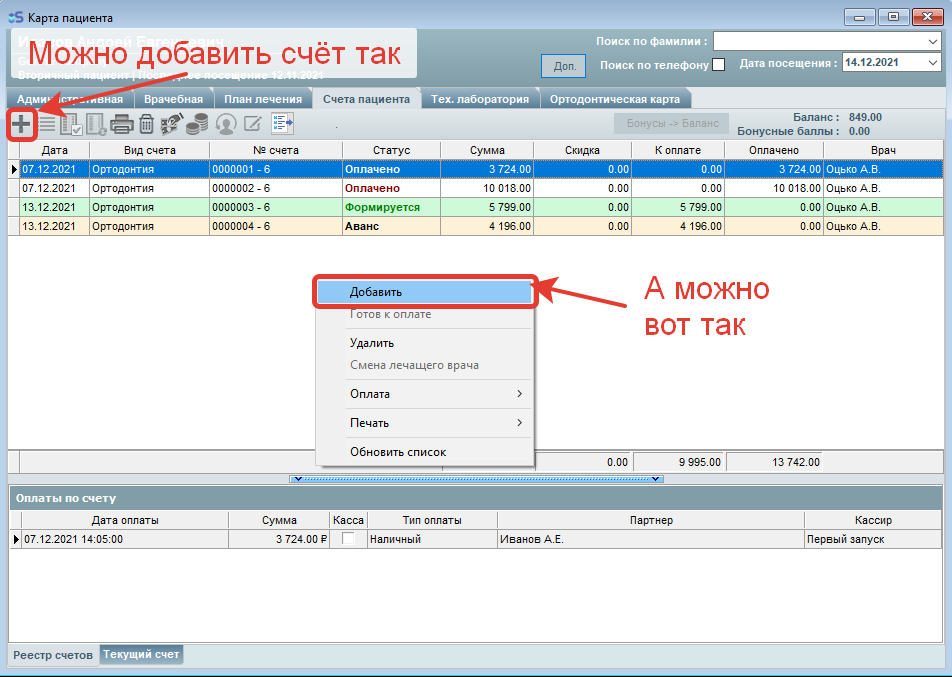
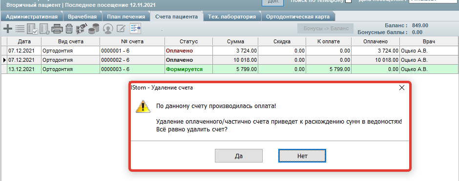
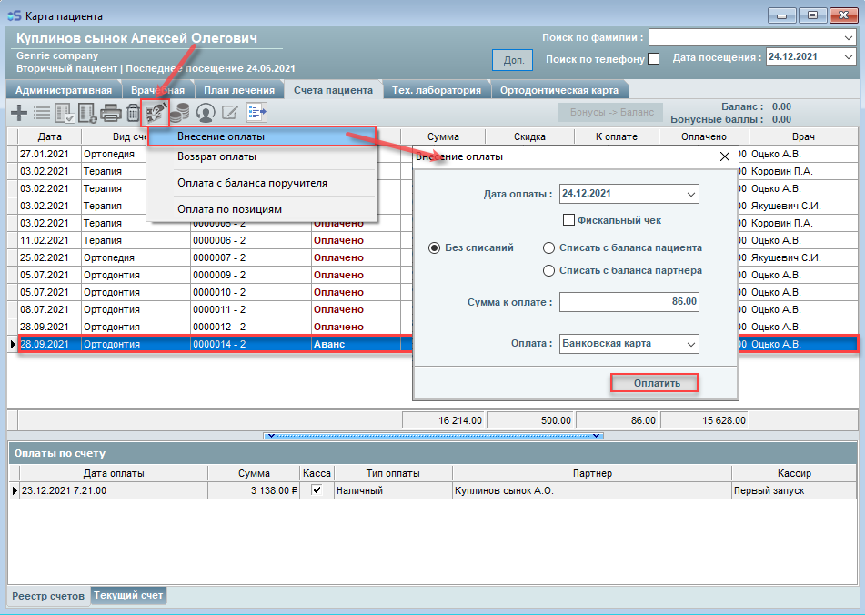

# Зубная формула и счета пациента

---

## Счета пациента, виды оплаты и зубная формула

#### Счета пациента, виды оплаты и как оплачивать.

> Формирование счёта для оплаты

В программе iStom реализована удобная система оплаты счетов пациента.

Сформировать счёт для оплаты можно двумя способами:

1. В карте пациента вкладка "План лечения".

2. В карте пациента непосредственно во вкладке "Счета пациента".

❗️❗️❗️ Прочитать про закрытие смены вы можете в инструкции по ссылке:

<http://istom.usedocs.com/article/7274> "Z и X - отчёты. Как открыть и закрыть смену?" ❗️❗️❗️

О втором способе подробнее:

1. Добавляем пустой счёт

2. Добавляем позиции в счёт

> 1 - открываем Прайс лист;
>
> 2 - Отмечаем галочкой необходимые позиции;
>
> 3 - Добавляем позиции в счёт (НУЖНО НАЖАТЬ ОДИН РАЗ);
>
> 4 - Закрываем Прайс лист.

Каждая строка подсвечена своим цветом, который зависит от статуса счёта:
"Формируется" - статус счёта, который еще не сформирован, в него всё еще можно добавлять позиции, но ПОКА СЧЁТ ФОРМИРУЕТСЯ - ЕГО НЕЛЬЗЯ ОПЛАТИТЬ!

Чтобы провести оплату по счёту - необходимо изменить статус счета с "Формируется", на "Аванс".

Для этого необходимо нажать кнопку "Готов к оплате" на панели сверху.

"Аванс" - статус счёта, который уже сформирован и готов к оплате, либо не полностью оплачен.

Строки, которые не подсвечиваются - имеют статус "Оплачено" - такой счёт уже ПОЛНОСТЬЮ оплачен или закрыт.

УДАЛЕНИЕ счетов также доступно! Для удаления счетов со статусами "Формируется" и "Аванс" (Если еще не вносилась оплата по счёту) - необходимо выделить необходимый счёт, нажать на него правой кнопкой мыши, затем "Удалить" (*либо нажать на кнопку "корзина" на панели вверху*) и подтвердить удаление.

Также можно удалить неполностью оплаченый и полностью оплаченый счёт, но перед удалением такого счёта программа предупредит вас о том, что при удалении могут возникнуть расхождения сумм в ведомостях, поэтому правильно будет сделать возврат той суммы, которая указана в оплате, а уже после возврата удалить счёт!

 

❗️❗️❗️ Прочитать про закрытие смены вы можете в инструкции по ссылке:

<http://istom.usedocs.com/article/7274> (Z и X - отчёты. Как открыть и закрыть смену?) ❗️❗️❗️

> Виды оплат:

1. Оплата наличными;

2. Оплата банковской картой (через терминал);

3. Безналичная оплата (перевод средств на счёт);

4. Кредит - это случай, при котором пациент не оплатил счёт до конца, и от него требуется последующая оплата (кредит).

Например, клиент оплатил 4 тысячи рублей из 7 тысяч. После этого он будет должен ещё 3 тысячи рублей. В чеке будет написан итог: общая сумма счета - 7 тысяч. Поступило - 4 тыс.

Сумма не совпадает потому, что был выбран тип оплаты "Кредит".
*В налоговую идут 2 вида оплаты - картой или наличными*. Посмотреть данные о сумме, которая ушла в налоговую, можно в Z-отчёте.
Команда IStom не проводит обучение бухгалтерскому делу.

> Как оплачивать счета:

Как описано выше -\> Чтобы провести оплату по счёту - необходимо изменить статус счета с "Формируется", на "Аванс".

Нажмите один раз левой кнопкой мыши на строку со счётом, который надо оплатить, затем на панели сверху выберите "Внесение оплаты"

 - вот такой значок, далее выбираем пункт "Внесение оплаты" и открывается окно оплаты счёта, в котором необходимо выбрать каким образом будет произведена оплата и вид оплаты, далее ввести сумму, которую вносит пациент (*по умолчанию при открытии окна в строку "Сумма к оплате" записывается* сумма  необходимая к оплате для полного закрытия счёта), после чего нажимаем "Оплатить" и если счёт оплачен полностью - статус счёта изменится с "Аванс" на "Оплачено".

---

## Есть ли у вас детская формула зубов

#### Есть ли у вас детская формула зубов?

Да, детская формула зубов присутствует в программе.

Она находится разделе "Карта пациента", во врачебной части.

---

