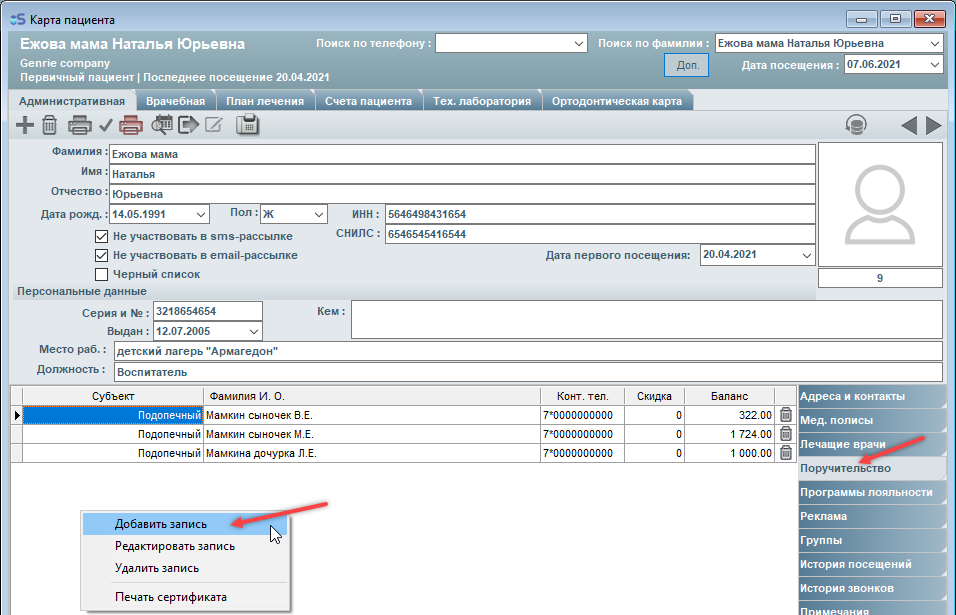
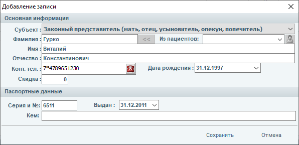
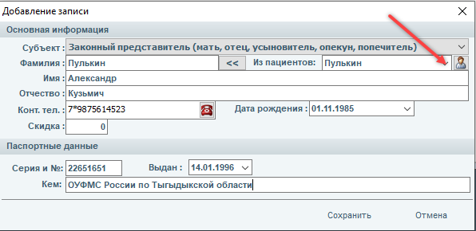
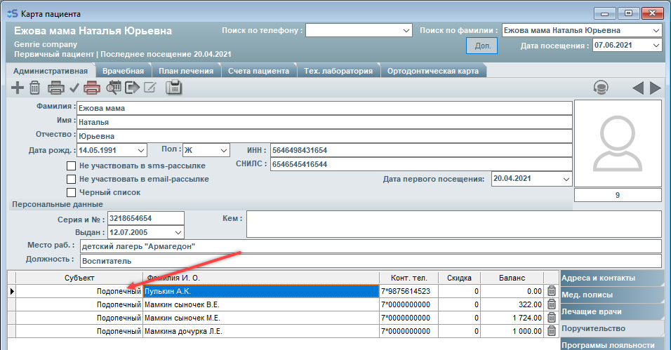
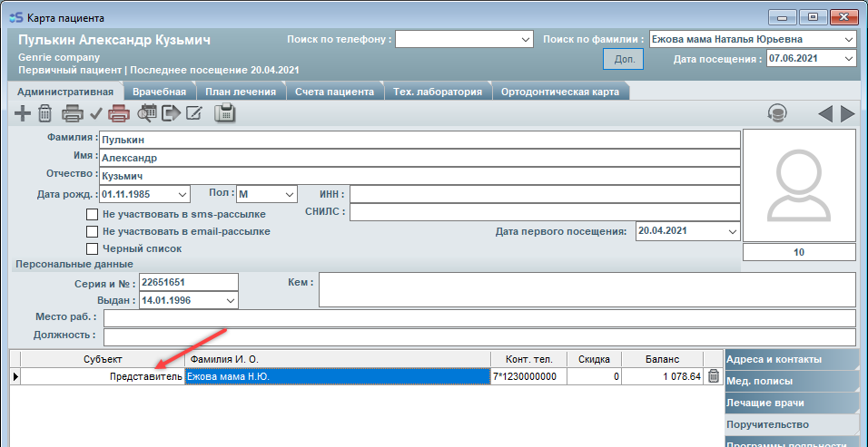
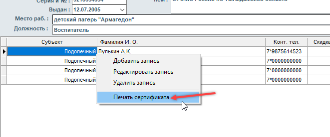
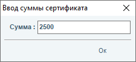
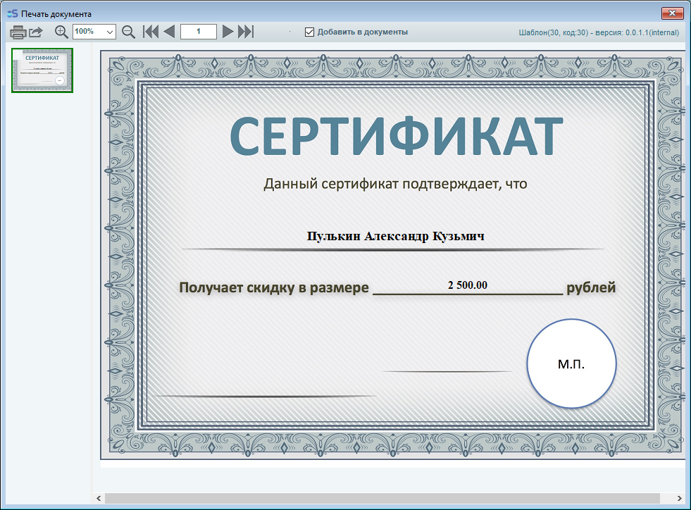

# Поручительство

---

## Поручительство

#### Поручительство

В пункте "Поручительство" карты пациента находятся родственники пациента.

Добавить родственников можно, нажав на правую кнопку мыши в поле поручительства, "Добавить запись"

При внесении родственников в поручительство могут быть две ситуации:

1. В карту пациента вносится родственник, у которого нет карты (просто заполняем поля и сохраняем).

2. В карту пациента вносится родственник, у которого есть карта (выбираем пациента из списка, который нужен, сохраняем).

При добавлении записи обращайте внимание на значение в поле "Субъект". Значение в этом поле указывает на то, кем является для пациента данный родственник (подопечный или представитель).

По двойному нажатию левой кнопкой мыши на фамилии родственника - происходит переход на карточку родственника.

При добавлении записи о поручительстве - запись добавляется в карточках у обоих родственников. Значения в полях "субъект" у обоих родственников обратны друг другу и при изменении у одного пациента - изменяется значение и у другого, т.е. если у пациента А пациент Б указан как подопечный, тогда у пациента Б пациент А указан как представитель.

Также присутствует функция печати сертификата на имя родственника.

Вводим сумму

---

## Оплата счёта с баланса поручителя

#### Оплата счёта с баланса поручителя

При оплате счёта присутствует возможность оплатить его с баланса поручителя.

Счёт подопечного можно оплатить с баланса его представителя:

Главное, чтобы у представителя были деньги на балансе, либо можно оплатить безналом.

---

