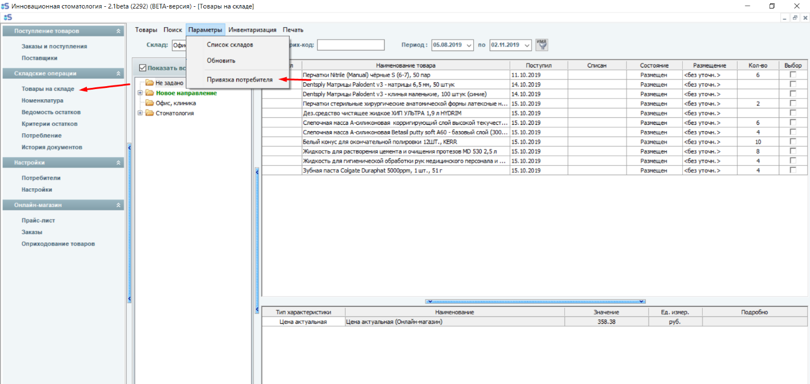
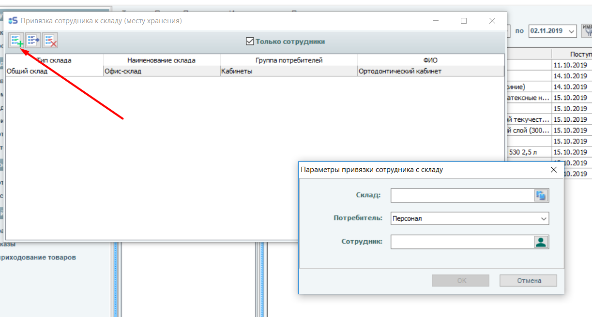

# Потребители склада

Как привязать потребителя к складу?

Для привязки потребителя к складу заходим в товары на складе, заходим в параметры.

Р

Нажимаем на привязку потребителя. Теперь нажимаем добавить, выбираем склад, к которому мы привязываем потребителя и выбираем тип потребителя и самого потребителя.

-
-
