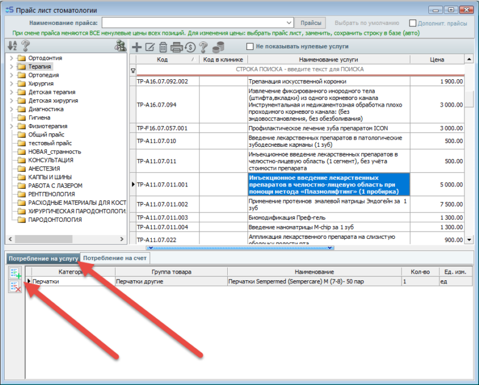
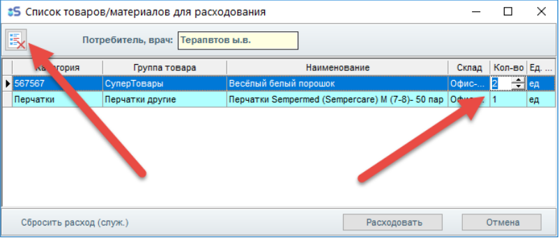
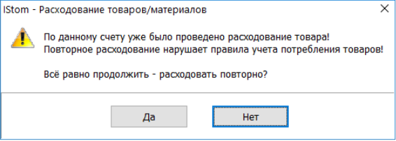
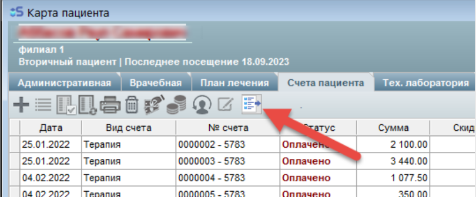

# Учёт материалов

#### Есть ли возможность учета материалов в данной версии? Или только учёт прихода материалов?

Полный учет материалов присутствует в версии "Pro" со складом.

---

## Потребление товаров и материалов при оплате счёта

### 1. Нормы потребления

Для назначения норм потребления материалов и товаров необходимо «привязать» их к позициям прайс-листа (Главное меню → Прайс-лист). Используйте кнопки добавления/удаления в таблице **Нормы потребления** по каждой услуге прайс-листа.

В нижней части окна «Прайс-лист стоматологии» находятся две вкладки — списки материалов/товаров на складе. При добавлении сначала выбирается нужный склад, затем — позиция на складе для списания при потреблении.

Допускается расходование материалов как на каждую позицию прайса в счёте, так и один раз на весь счёт (если в нём присутствует выбранная услуга прайса).

### 2. Потребление при оплате

В процессе оплаты по счёту, содержащему позиции с настроенными нормами потребления, **после оплаты автоматически** появляется окно со списком потребления материалов/товаров по текущему счёту с указанием количества расходования со склада.

В этом окне допускается:

- Менять количество расходуемых товаров
- Удалить позицию из списка потребления по данному счёту

!!! warning "Важно"
    Если кнопка **«Расходовать»** не была нажата — при закрытии окна потребление произведено НЕ будет.

Потребление по счёту производится **1 раз**, независимо от количества платежей по нему. При нескольких платежах после первой оплаты будет выдано информационное сообщение о том, что потребление уже произведено.

### 3. Потребление по ранее оплаченному счёту

Если счёт был оплачен ранее без расходования — в карточке пациента в списке счетов появится кнопка вызова окна потребления (аналогично п. 2).

### 4. Настройка потребления по конкретному счёту

В карточке пациента → «Счета пациента» → выберите внизу вкладку **«Текущий счёт»** → выберите услугу, к которой привязано потребление.

Под заголовком вкладки появится кнопка изменения списка потребления. По нажатию открывается диалог со списком материалов/товаров по данной позиции счёта, где можно добавить новые записи или загрузить из норм потребления.

!!! note "Примечание"
    В списке показывается только набор материалов по **выбранной позиции** счёта — не по всему счёту.

### 5. Просмотр потребления — раздел в основном меню

Раздел **«Склад» → Потребление**. Открывается окно с набором вкладок:

| Вкладка | Содержание |
|---------|------------|
| **По сотрудникам** | Выбор врача, группировка по материалам или по услугам |
| **По счетам** | Список счетов с суммарным потреблением, НДС и датами оплат |
| **По материалам** | Перечень материалов с группировкой по врачам и суммами оплат |
| **Движение по складам** | Движение материалов с датой, типом действия, суммами |
| **История потребления** | Полный перечень всех выполненных потреблений |

На всех вкладках в верхней части расположен **фильтр по датам потребления**. Фильтры на вкладках работают независимо.

