# Продажи с витрины

!!! info "Версия"
    Функция продаж с витрины доступна пользователям версии **Ultimate**.

Модуль позволяет продавать товары со склада напрямую — пациентам, партнёрам или частным лицам.

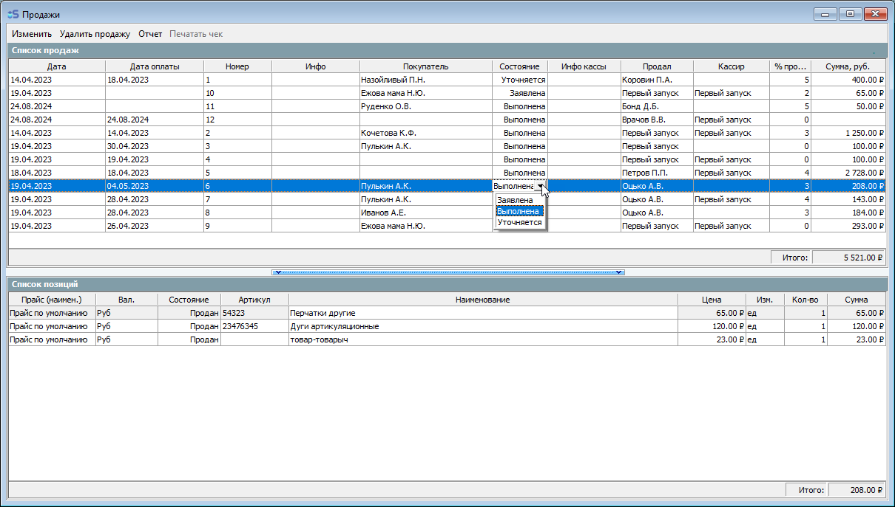

## Кто может быть покупателем

| Тип покупателя | Требование |
|----------------|------------|
| **Пациент клиники** | Наличие заведённой карты пациента |
| **Компания-партнёр** | Указать данные из реестра поставщиков (Раздел «Организация» → Партнёры → Юридические лица) |
| **Частное лицо** | Данные не требуются |

## Подготовка к продаже

### 1. Создать прайс-лист продаж с витрины

Раздел **«Склад» → Продажи → Прайс-лист**.

Заполните поля: Наименование, Начало и Окончание действия, активируйте галочку **«Активен»**.

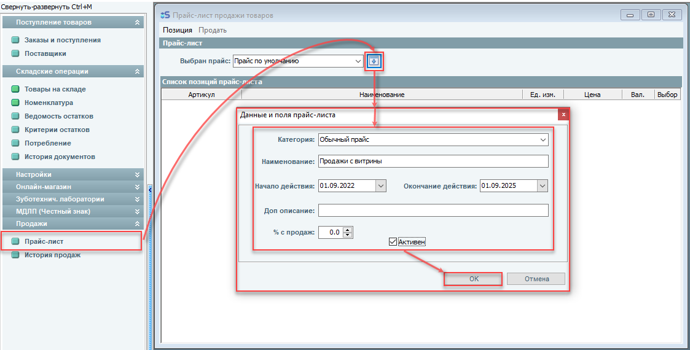

### 2. Добавить товары на склад

Если нужных товаров нет на складе — добавьте их (см. инструкцию по основным операциям на складе).

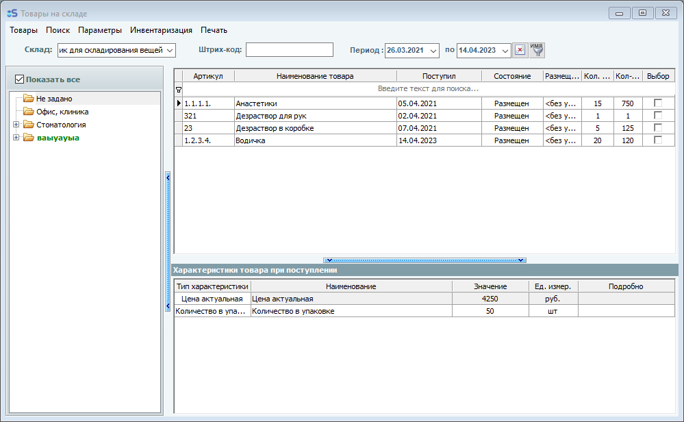

### 3. Добавить позиции в прайс-лист

Не закрывая окно товаров на складе, откройте созданный прайс-лист и добавьте в него позиции.

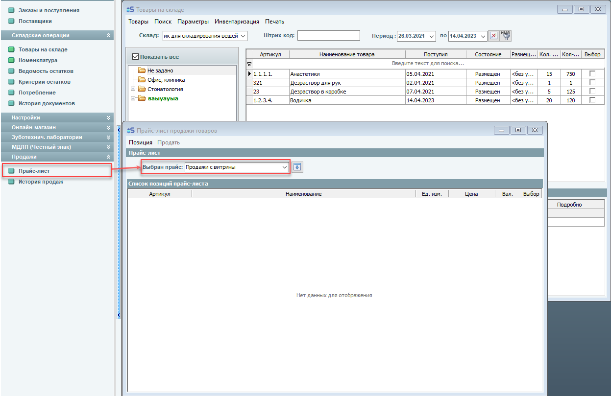

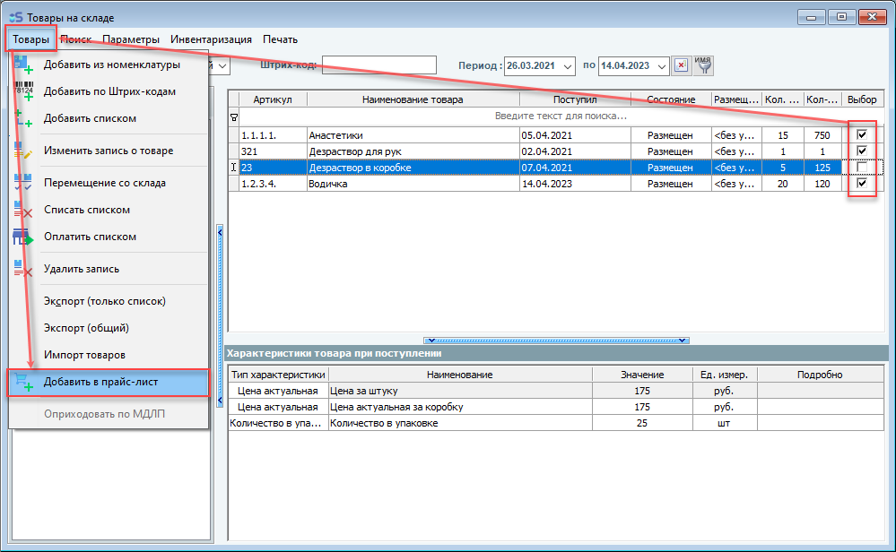

### 4. Выставить цены

Позиции создаются с ценой 0 — установите цены вручную.

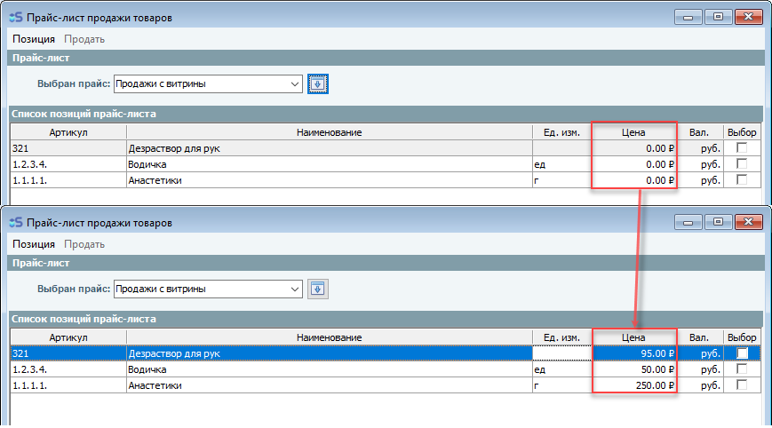

## Действия в прайс-листе

- **Удаление позиций** — пункт «Удалить» в меню окна «Прайс-лист продажи товаров»

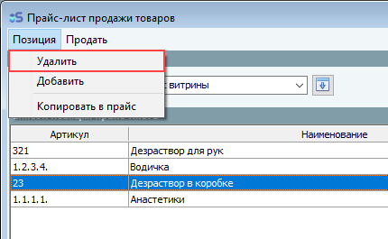

- **Копирование в другой прайс-лист** — пункт «Копировать в прайс» (предварительно нужно создать целевой прайс-лист)

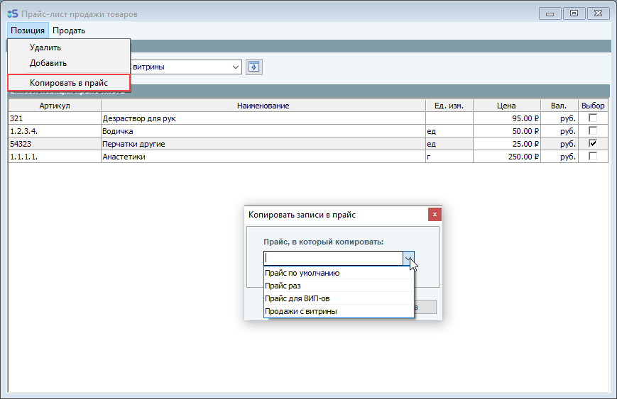

- **Редактирование цен** — напрямую в таблице прайс-листа

## Переключение между прайс-листами

Откройте окно «Прайс-лист продажи товаров» и переключайтесь между прайсами по мере необходимости.

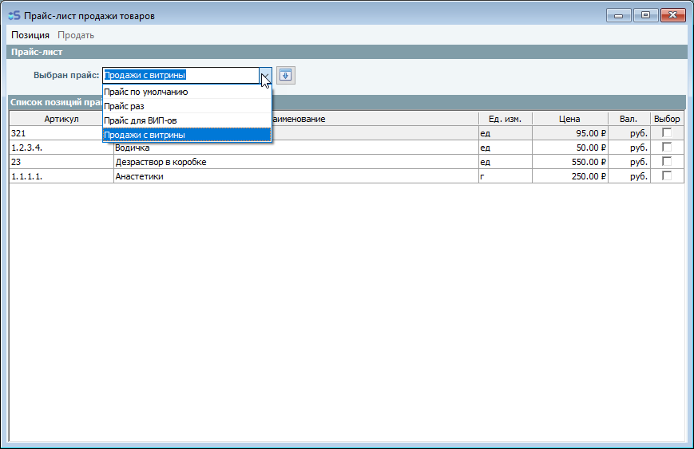

## Как продавать с витрины

1. Отметьте нужные товары галочкой и нажмите **«Продать»**.

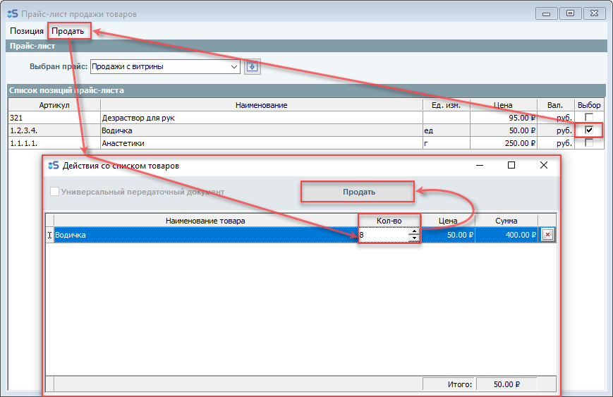

2. В открывшемся окне заполните параметры продажи и нажмите **«ОК»**.

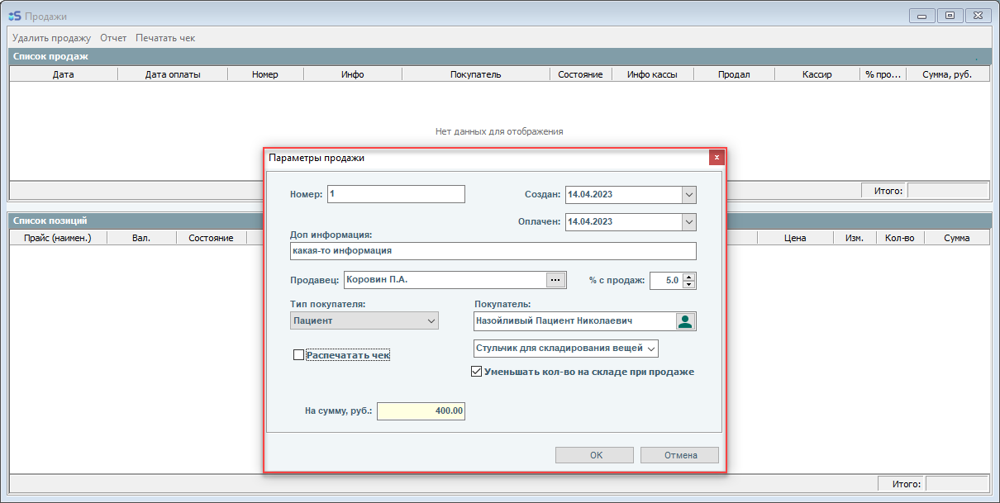

3. После подтверждения откроется **окно истории продаж**.
