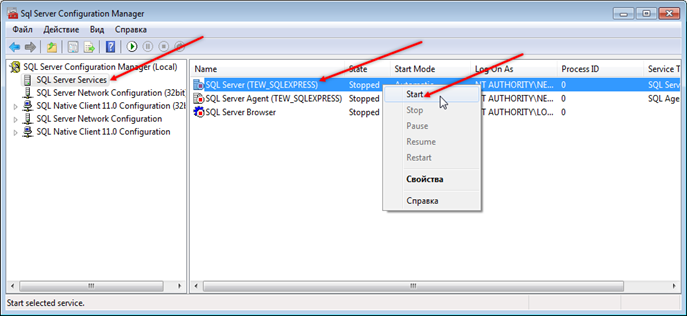
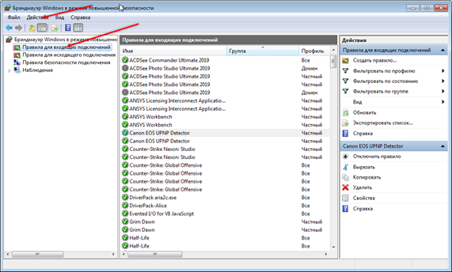
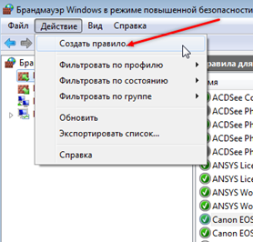
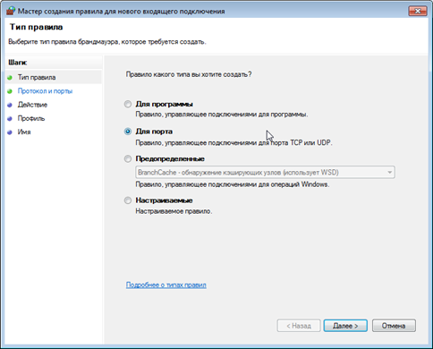
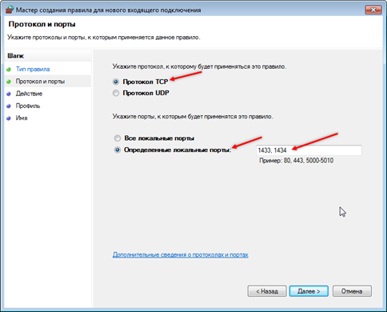
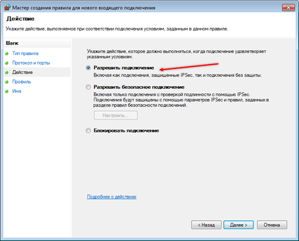
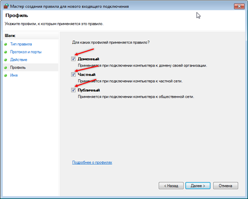
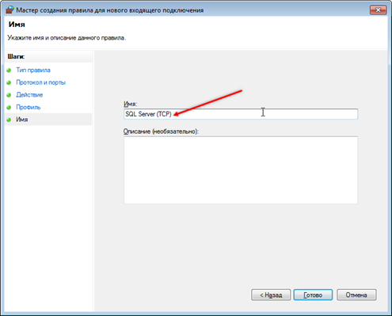

# Ошибки SQL

---

## Как исправить ошибку запуска службы SQL Server

Как исправить ошибку запуска службы "SQL Server"?

При ошибке подключения в службе SQL необходимо первым делом перезагрузить компьютер. Если это не помогает, запускаем службу вручную:

- Пуск → В поиске находим "SQL Server Configuration Manager" (на вашем ПК название может отличаться из-за различия в версии, поэтому не обращаем на это внимание, пишем в поиске "SQL", открываем Configuration Manager).

- В окне SQL Server Configuration Manager находим и нажимаем на SQL Server Services, затем в правой части находим необходимый нам SQL Server (Имя сервера) и, если в столбике State значение для нашей службы "Stopped", нажимаем правой кнопкой мыши на строке с нашим сервером и запускаем службу, нажав в контекстном меню «Start», как показано на рисунке ниже.

---

## Настройка входящих и исходящих подключений SQL

#### Настройка входящих/исходящих подключений службы SQL Server для локальной базы

Настройка службы SQL Server для локальной базы:

В Windows 7 открываем: Пуск → Панель управления → Система и безопасность → Брандмауэр Windows → Дополнительные параметры (откроется Брандмауэр Windows в режиме повышенной безопасности), также можно в поиске меню ввести «Брандмауэр» и открыть сразу «Брандмауэр Windows в режиме повышенной безопасности».

В Windows 10 брандмауэр можно также открыть через поиск, необходимо в поиске ввести "Монитор брандмауэра" и из результатов поиска выбрать "Монитор брандмауэра Защитника Windows в режиме повышенной безопасности".

Создание правила:

Слева выбираем «Правила для входящих подключений», затем сверху «Действие» и «Создать правило».

Тип правила

Протокол и порты

Действие

Профиль

Имя

Нажимаем «Готово» и создаём правило ещё раз точно так же, но на шаге «Протокол и порты» выбираем «Протокол UDP», а также на шаге «Имя» пишем «SQL Server (UDP)». Далее необходимо перейти в «Правила для исходящего подключения» на панели слева и таким же образом создать два правила: одно для протокола TCP, второе для UDP.

---
